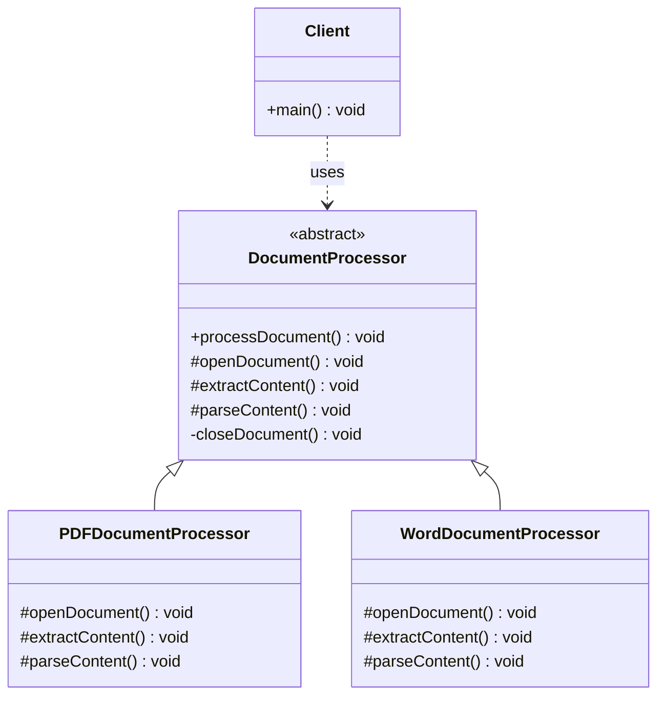
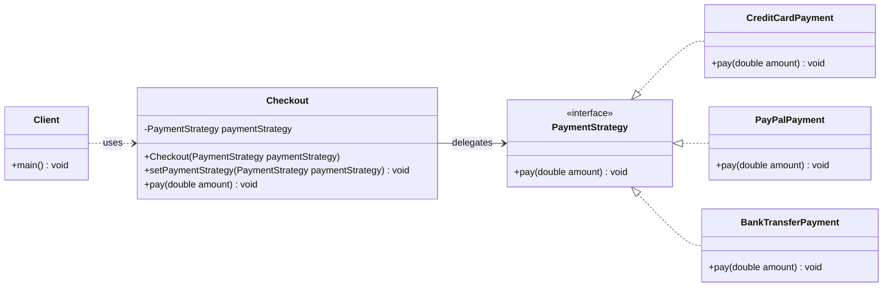
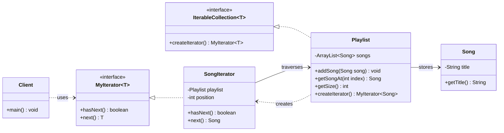
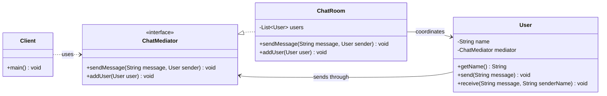
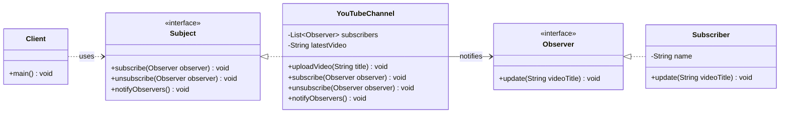

# Behavioral Design Patterns Guide

This file documents the behavioral design patterns implemented in [`behavioral_design_patterns/Main.java`](behavioral_design_patterns/Main.java).

The main concern of behavioral patterns is the communications and the assignment of responsibilities between objects.

Behavioral patterns describe patterns of classes/objects and
communication among them.

Behavioral class patterns use inheritance to distribute behavior
between classes.

Behavioral object patterns use object composition rather than inheritance.

Behavioral object patterns are concerned with encapsulating behavior in an object and delegating requests to it.

There are five behavioral patterns implemented in this project:

1. Template Method defines the fixed steps of an algorithm while allowing subclasses to customize some steps.
2. Strategy allows an algorithm or behavior to be selected and changed at runtime.
3. Iterator provides a standard way to move through a collection without exposing its internal storage.
4. Mediator centralizes communication between objects to reduce direct dependencies.
5. Observer notifies dependent objects automatically when a subject changes.

| Pattern | Implemented example | Main purpose | Main SOLID focus |
|---|---|---|---|
| Template Method | `DocumentProcessor` | Define a fixed processing algorithm with customizable steps | OCP and SRP |
| Strategy | `PaymentStrategy` with `Checkout` | Change payment behavior at runtime | OCP and DIP |
| Iterator | `Playlist` and `SongIterator` | Traverse songs without exposing internal storage | SRP and encapsulation |
| Mediator | `ChatRoom` | Coordinate users without direct user-to-user references | SRP and low coupling |
| Observer | `YouTubeChannel` and `Subscriber` | Notify subscribers when a new video is uploaded | OCP and DIP |

> Note: Design patterns do not map perfectly to one SOLID principle. The table shows the principle each pattern supports most clearly in this code.

---

## 1. Template Method Design Pattern

### Where it appears

The Template Method pattern is implemented using:

1. `DocumentProcessor`
2. `PDFDocumentProcessor`
3. `WordDocumentProcessor`

The abstract class defines the fixed algorithm:

```java
abstract class DocumentProcessor {
    public final void processDocument() {
        openDocument();
        extractContent();
        parseContent();
        closeDocument();
    }

    protected abstract void openDocument();
    protected abstract void extractContent();
    protected abstract void parseContent();

    private void closeDocument() {
        System.out.println("closing the document.");
    }
}
```

Concrete subclasses customize the variable steps:

```java
class PDFDocumentProcessor extends DocumentProcessor {
    @Override
    protected void openDocument() {
        System.out.println("opening pdf document.");
    }

    @Override
    protected void extractContent() {
        System.out.println("extracting pdf content.");
    }

    @Override
    protected void parseContent() {
        System.out.println("parsing pdf content.");
    }
}
```

### When it is used

Use Template Method when several classes follow the same overall process, but some steps are different for each subclass.

Common examples:

1. Processing different document formats.
2. Running a fixed data import workflow with different parsing steps.
3. Building reports with a shared generation process.
4. Executing a test workflow where setup and validation differ.

In this project, every document processor follows the same process: open, extract, parse, and close. `PDFDocumentProcessor` and `WordDocumentProcessor` provide their own implementations for the document-specific steps.

### Main SOLID principle focus

Template Method mainly supports the **Open/Closed Principle (OCP)**.

The processing algorithm can be extended by adding a new subclass, such as an Excel document processor, without changing the base workflow in `DocumentProcessor`.

It also supports the **Single Responsibility Principle (SRP)** because the base class controls the general process while subclasses handle format-specific details.

### UML diagram



---

## 2. Strategy Design Pattern

### Where it appears

The Strategy pattern is implemented using:

1. `PaymentStrategy`
2. `CreditCardPayment`
3. `PayPalPayment`
4. `BankTransferPayment`
5. `Checkout`

The strategy interface defines the interchangeable behavior:

```java
interface PaymentStrategy {
    void pay(double amount);
}
```

Concrete strategies implement different payment rules:

```java
class CreditCardPayment implements PaymentStrategy {
    @Override
    public void pay(double amount) {
        System.out.println("paying " + amount + " using credit card.");
    }
}
```

The context object delegates payment work to the selected strategy:

```java
class Checkout {
    private PaymentStrategy paymentStrategy;

    public Checkout(PaymentStrategy paymentStrategy) {
        this.paymentStrategy = paymentStrategy;
    }

    public void setPaymentStrategy(PaymentStrategy paymentStrategy) {
        this.paymentStrategy = paymentStrategy;
    }

    public void pay(double amount) {
        paymentStrategy.pay(amount);
    }
}
```

### When it is used

Use Strategy when an object needs to choose between multiple behaviors and that behavior may change at runtime.

Common examples:

1. Payment methods in an online checkout.
2. Sorting algorithms selected by data size.
3. Discount calculation rules.
4. Shipping cost calculation strategies.

In this project, `Checkout` can use bank transfer, PayPal, or credit card payment without changing the checkout class itself.

### Main SOLID principle focus

Strategy mainly supports the **Open/Closed Principle (OCP)**.

New payment methods can be added by creating new `PaymentStrategy` implementations without changing `Checkout`.

It also supports the **Dependency Inversion Principle (DIP)** because `Checkout` depends on the `PaymentStrategy` abstraction instead of concrete payment classes.

### UML diagram



---

## 3. Iterator Design Pattern

### Where it appears

The Iterator pattern is implemented using:

1. `MyIterator`
2. `IterableCollection`
3. `Playlist`
4. `SongIterator`
5. `Song`

The iterator interface defines traversal operations:

```java
interface MyIterator<T> {
    boolean hasNext();
    T next();
}
```

The collection interface defines how to create an iterator:

```java
interface IterableCollection<T> {
    MyIterator<T> createIterator();
}
```

The playlist stores songs internally and returns a song iterator:

```java
class Playlist implements IterableCollection<Song> {
    private final ArrayList<Song> songs = new ArrayList<>();

    public void addSong(Song song) {
        songs.add(song);
    }

    public Song getSongAt(int index) {
        return songs.get(index);
    }

    public int getSize() {
        return songs.size();
    }

    @Override
    public MyIterator<Song> createIterator() {
        return new SongIterator(this);
    }
}
```

The iterator controls traversal:

```java
class SongIterator implements MyIterator<Song> {
    private final Playlist playlist;
    private int position;

    public SongIterator(Playlist playlist) {
        this.playlist = playlist;
        this.position = 0;
    }

    @Override
    public boolean hasNext() {
        return position < playlist.getSize();
    }

    @Override
    public Song next() {
        Song song = playlist.getSongAt(position);
        position++;
        return song;
    }
}
```

### When it is used

Use Iterator when client code needs to move through a collection without depending on how that collection stores its items.

Common examples:

1. Traversing songs in a playlist.
2. Moving through records in a database result set.
3. Iterating over tree or graph structures.
4. Reading items from a custom collection.

In this project, client code uses `MyIterator<Song>` to move through songs without directly accessing the playlist's internal `ArrayList`.

### Main SOLID principle focus

Iterator mainly supports the **Single Responsibility Principle (SRP)**.

`Playlist` is responsible for storing songs, while `SongIterator` is responsible for traversal.

It also improves encapsulation because the client does not need to know how songs are stored internally.

### UML diagram



---

## 4. Mediator Design Pattern

### Where it appears

The Mediator pattern is implemented using:

1. `ChatMediator`
2. `ChatRoom`
3. `User`

The mediator interface defines communication operations:

```java
interface ChatMediator {
    void sendMessage(String message, User sender);
    void addUser(User user);
}
```

The concrete mediator coordinates users:

```java
class ChatRoom implements ChatMediator {
    private final List<User> users = new ArrayList<>();

    @Override
    public void addUser(User user) {
        users.add(user);
    }

    @Override
    public void sendMessage(String message, User sender) {
        for (User user : users) {
            if (user != sender) {
                user.receive(message, sender.getName());
            }
        }
    }
}
```

Each user communicates through the mediator:

```java
class User {
    private final String name;
    private final ChatMediator mediator;

    public User(String name, ChatMediator mediator) {
        this.name = name;
        this.mediator = mediator;
    }

    public void send(String message) {
        mediator.sendMessage(message, this);
    }

    public void receive(String message, String senderName) {
        System.out.println(name + " received from " + senderName + ": " + message);
    }
}
```

### When it is used

Use Mediator when many objects communicate with each other and direct references would create tight coupling.

Common examples:

1. Chat room message coordination.
2. UI form controls coordinating through a dialog object.
3. Air traffic control coordinating aircraft.
4. Workflow objects communicating through a central coordinator.

In this project, users do not store references to every other user. They send messages through `ChatRoom`, which decides who receives each message.

### Main SOLID principle focus

Mediator mainly supports low coupling and the **Single Responsibility Principle (SRP)**.

`User` is responsible for sending and receiving messages, while `ChatRoom` is responsible for coordinating communication.

This reduces direct dependencies because users depend on `ChatMediator` rather than on each other.

### UML diagram



---

## 5. Observer Design Pattern

### Where it appears

The Observer pattern is implemented using:

1. `Observer`
2. `Subject`
3. `YouTubeChannel`
4. `Subscriber`

The observer interface defines the notification method:

```java
interface Observer {
    void update(String videoTitle);
}
```

The subject interface defines subscription operations:

```java
interface Subject {
    void subscribe(Observer observer);
    void unsubscribe(Observer observer);
    void notifyObservers();
}
```

The concrete subject stores subscribers and notifies them:

```java
class YouTubeChannel implements Subject {
    private final List<Observer> subscribers = new ArrayList<>();
    private String latestVideo;

    public void uploadVideo(String title) {
        latestVideo = title;
        notifyObservers();
    }

    @Override
    public void subscribe(Observer observer) {
        subscribers.add(observer);
    }

    @Override
    public void unsubscribe(Observer observer) {
        subscribers.remove(observer);
    }

    @Override
    public void notifyObservers() {
        for (Observer subscriber : subscribers) {
            subscriber.update(latestVideo);
        }
    }
}
```

The concrete observer reacts to updates:

```java
class Subscriber implements Observer {
    private final String name;

    public Subscriber(String name) {
        this.name = name;
    }

    @Override
    public void update(String videoTitle) {
        System.out.println(name + " was notified: " + videoTitle);
    }
}
```

### When it is used

Use Observer when one object changes and many dependent objects should be notified automatically.

Common examples:

1. YouTube subscribers receiving upload notifications.
2. UI views updating when application state changes.
3. Event listeners reacting to user actions.
4. Stock price alerts notifying registered users.

In this project, `YouTubeChannel` notifies all subscribed `Subscriber` objects whenever a new video is uploaded.

### Main SOLID principle focus

Observer mainly supports the **Open/Closed Principle (OCP)**.

New observer types can be added without changing `YouTubeChannel`, as long as they implement `Observer`.

It also supports the **Dependency Inversion Principle (DIP)** because the channel depends on the `Observer` abstraction instead of concrete subscriber classes.

### UML diagram



---

## Quick Comparison

| Pattern | Problem it solves | What the client avoids |
|---|---|---|
| Template Method | A workflow has fixed steps but variable details | Duplicating the same algorithm in many classes |
| Strategy | Behavior must be interchangeable at runtime | Large conditional statements for every behavior |
| Iterator | A collection must be traversed safely | Accessing internal collection storage directly |
| Mediator | Many objects communicate with each other | Tight object-to-object coupling |
| Observer | Many objects need updates when one object changes | Manually notifying every dependent object |

## Summary

The implemented behavioral patterns organize communication and behavior between objects:

1. `DocumentProcessor` uses Template Method to define a fixed document processing workflow.
2. `Checkout` uses Strategy to switch between payment methods at runtime.
3. `Playlist` and `SongIterator` use Iterator to traverse songs without exposing storage details.
4. `ChatRoom` uses Mediator to coordinate communication between users.
5. `YouTubeChannel` uses Observer to notify subscribers when a new video is uploaded.
