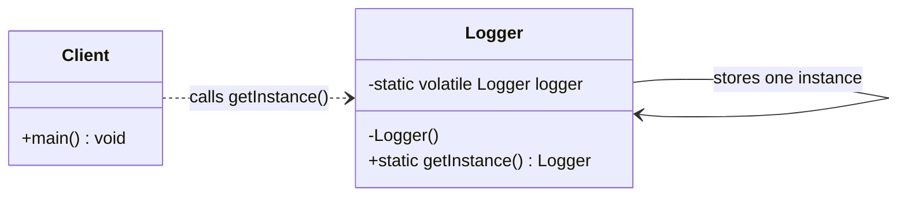
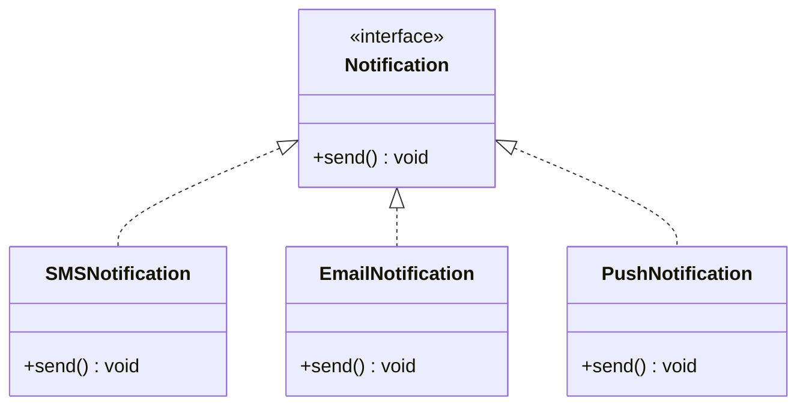
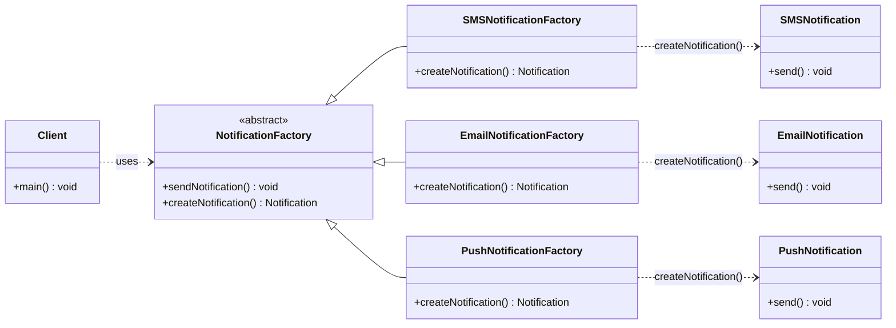
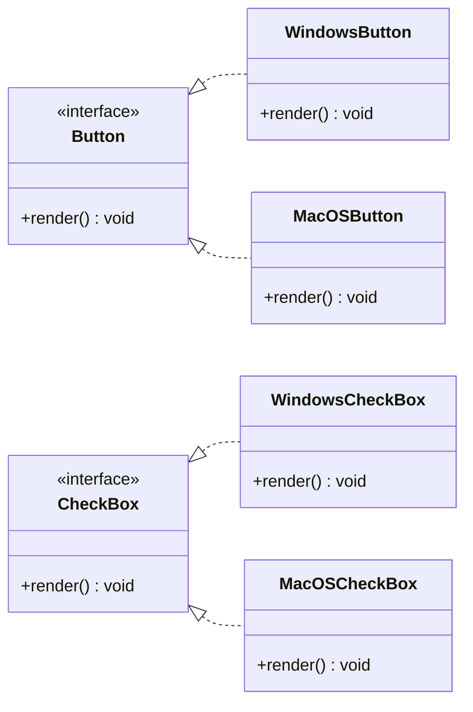
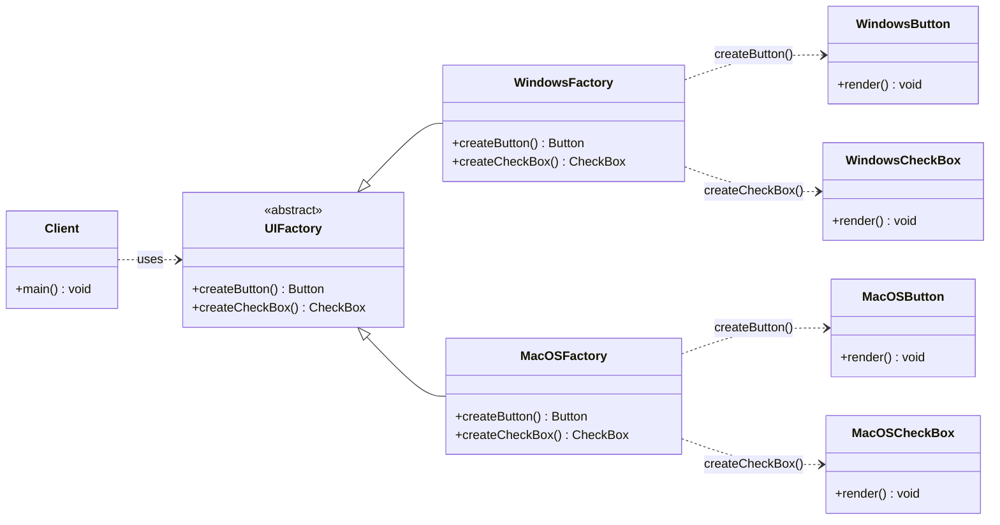

# Creational Design Patterns Guide

This file documents the creational design patterns implemented in [`creational_design_patterns/Main.java`](creational_design_patterns/Main.java).

Creational patterns focus on object creation. Instead of letting client code directly create every object with `new`, they help control how objects are created, reused, and connected.

Creational patterns abstract the object instantiation process.

Creational patterns become essential as systems improve to depend more on composition than inheritance. This creates a need for more flexible ways of instantiating objects than simply creating objects directly from classes.

There are two recurring themes in these patterns:

1. They encapsulate all the elements, operations, and data that concrete classes in the system use.
2. They hide how instances of these classes are created and put together.

| Pattern | Implemented example | Main purpose | Main SOLID focus |
|---|---|---|---|
| Singleton | `Logger` | Ensure one shared object instance | SRP, with caution around DIP |
| Factory Method | `NotificationFactory` | Let subclasses decide which object to create | OCP and DIP |
| Abstract Factory | `UIFactory` | Create families of related objects | DIP and OCP |

> Note: Design patterns do not map perfectly to one SOLID principle. The table shows the principle each pattern supports most clearly in this code.

---

## 1. Singleton Design Pattern

### Where it appears

The Singleton pattern is implemented by the `Logger` class.

```java
class Logger {
    private static volatile Logger logger;

    private Logger(){}

    public static Logger getInstance() {
        if (logger == null) {
            synchronized(Logger.class) {
                if(logger == null) {
                    logger = new Logger();
                }
            }
        }
        return logger;
    }
}
```

### When it is used

Use Singleton when an application must share exactly one instance of a class.

Common examples:

1. Logging system.
2. Application configuration.
3. Cache manager.
4. Database connection manager, although connection pools are usually better in real applications.

In this project, the logger should be shared so all parts of the application use the same logging configuration and formatting.

### Main SOLID principle focus

Singleton mainly relates to the **Single Responsibility Principle (SRP)** when the single instance has one clear responsibility.

In this code, `Logger` has one responsibility: provide one shared logger instance.

However, Singleton should be used carefully because it can conflict with the **Dependency Inversion Principle (DIP)** if many classes directly call `Logger.getInstance()`. That makes those classes depend on a concrete global object instead of an abstraction.

### UML diagram



---

## 2. Factory Method Design Pattern

### Where it appears

The Factory Method pattern is implemented using:

1. `NotificationFactory`
2. `SMSNotificationFactory`
3. `EmailNotificationFactory`
4. `PushNotificationFactory`
5. `Notification`
6. `SMSNotification`
7. `EmailNotification`
8. `PushNotification`

The abstract factory class defines the creation method:

```java
abstract class NotificationFactory {
    public void sendNotification() {
        Notification notification = createNotification();
        notification.send();
    }

    public abstract Notification createNotification();
}
```

Each concrete factory decides which notification object to create:

```java
class SMSNotificationFactory extends NotificationFactory {
    @Override
    public Notification createNotification() {
        return new SMSNotification();
    }
}
```

### When it is used

Use Factory Method when client code should work with a general product type, but the exact concrete object should be chosen by a factory subclass.

Common examples:

1. Creating different notification types.
2. Creating different document exporters.
3. Creating different payment processors.
4. Creating different parser objects depending on file type.

In this project, the client works with `NotificationFactory` and `Notification`, instead of directly creating `SMSNotification`, `EmailNotification`, or `PushNotification`.

### Main SOLID principle focus

Factory Method mainly supports the **Open/Closed Principle (OCP)**.

The notification system is open for extension because a new notification type can be added by creating a new `Notification` implementation and a new `NotificationFactory` subclass.

It also supports the **Dependency Inversion Principle (DIP)** because the client depends on the `NotificationFactory` abstraction and the `Notification` interface instead of concrete notification classes.

### UML diagram

#### Product hierarchy



#### Factory hierarchy and creation flow



---

## 3. Abstract Factory Design Pattern

### Where it appears

The Abstract Factory pattern is implemented using:

1. `UIFactory`
2. `WindowsFactory`
3. `MacOSFactory`
4. `Button`
5. `CheckBox`
6. `WindowsButton`
7. `WindowsCheckBox`
8. `MacOSButton`
9. `MacOSCheckBox`

The abstract factory defines methods for creating a family of UI components:

```java
abstract class UIFactory {
    public abstract Button createButton();
    public abstract CheckBox createCheckBox();
}
```

Each concrete factory creates matching components for one operating system:

```java
class WindowsFactory extends UIFactory {
    @Override
    public Button createButton() {
        return new WindowsButton();
    }

    @Override
    public CheckBox createCheckBox() {
        return new WindowsCheckBox();
    }
}
```

### When it is used

Use Abstract Factory when an application needs to create families of related objects without mixing incompatible products.

Common examples:

1. Cross-platform UI components.
2. Database-specific query builders.
3. Theme-specific components.
4. Cloud-provider-specific services.

In this project, `WindowsFactory` creates Windows UI components, and `MacOSFactory` creates MacOS UI components. This prevents accidentally mixing a Windows button with a MacOS checkbox.

### Main SOLID principle focus

Abstract Factory mainly supports the **Dependency Inversion Principle (DIP)**.

The client code depends on the abstract `UIFactory`, `Button`, and `CheckBox` types instead of concrete classes like `WindowsButton` or `MacOSCheckBox`.

It also supports the **Open/Closed Principle (OCP)** because a new operating system family can be added by creating a new factory and new product classes, without changing the existing factories.

### UML diagram

#### Product hierarchy



#### Factory hierarchy and creation flow



---

## Quick Comparison

| Pattern | Problem it solves | What the client avoids |
|---|---|---|
| Singleton | Only one instance should exist | Creating many duplicate objects |
| Factory Method | One product is needed, but the exact type may vary | Directly instantiating concrete product classes |
| Abstract Factory | A group of related products must be created together | Mixing products from different families |

## Summary

The implemented creational patterns all reduce direct object creation in client code:

1. `Logger` controls creation of one shared logger.
2. `NotificationFactory` lets subclasses create specific notification objects.
3. `UIFactory` creates related UI component families for each platform.
