# Mixed Scenario-Based Design Patterns Practice — Exam Style

This file is designed to match the final-exam style: each question gives only a scenario. You must infer the most suitable design pattern yourself.

For each question, answer the following:

1. Decide the most suitable design pattern.
2. Justify why this pattern fits the scenario.
3. Draw a UML class diagram representing the solution.
4. Write the Java implementation.
5. Include a `Client` or `Main` class demonstrating usage.

Patterns covered in the overall bank:

- Singleton
- Factory Method
- Abstract Factory
- Adapter
- Bridge
- Decorator
- Flyweight
- Template Method
- Strategy
- Iterator
- Mediator
- Observer

Important: The scenarios do not tell you which pattern to use. Some patterns appear more than once. Some patterns do not appear in the same frequency.

---

# Part A — Easy Scenarios

## Question 1 — Application Settings

A desktop application loads configuration values such as theme, language, database URL, and timeout settings. These values must be accessible from many parts of the program. The system must guarantee that only one configuration manager object exists, because multiple instances could lead to inconsistent settings.

Required:

- Choose the most suitable design pattern.
- Draw the UML diagram.
- Write the Java implementation.
- Include a `Main` class that retrieves the configuration object more than once and proves that the same object is reused.

---

## Answer 1 - Application Settings

**Pattern:** Singleton

**Justification:** The configuration manager must have exactly one shared instance so all parts of the application read and update the same configuration values.

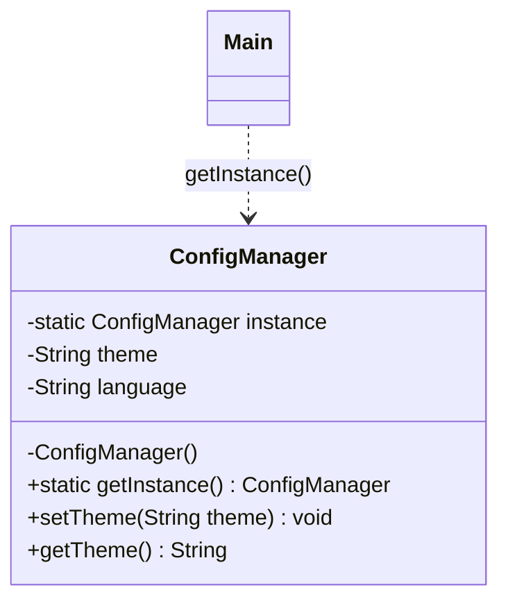
```mermaid
classDiagram
    class Main
    class ConfigManager {
        -static ConfigManager instance
        -String theme
        -String language
        -ConfigManager()
        +static getInstance() ConfigManager
        +setTheme(String theme) void
        +getTheme() String
    }
    Main ..> ConfigManager : getInstance()
```

```java
class ConfigManager {
    private static ConfigManager instance;
    private String theme = "Light";
    private String language = "English";

    private ConfigManager() {}

    public static ConfigManager getInstance() {
        if (instance == null) {
            instance = new ConfigManager();
        }
        return instance;
    }

    public void setTheme(String theme) {
        this.theme = theme;
    }

    public String getTheme() {
        return theme;
    }

    public String getLanguage() {
        return language;
    }
}

public class Main {
    public static void main(String[] args) {
        ConfigManager config1 = ConfigManager.getInstance();
        ConfigManager config2 = ConfigManager.getInstance();

        config1.setTheme("Dark");

        System.out.println(config2.getTheme());
        System.out.println(config1 == config2);
    }
}
```

---

## Question 2 — Payment Calculation

An online store supports several payment discount rules. A regular customer gets no discount, a student gets 10%, and a VIP customer gets 20%. The checkout code should not contain many `if` or `switch` statements for discount calculation. The store expects to add new discount rules later.

Required:

- Choose the most suitable design pattern.
- Draw the UML diagram.
- Write the Java implementation.
- Include a `Main` class that applies different discount rules to the same checkout object.

---

## Answer 2 - Payment Calculation

**Pattern:** Strategy

**Justification:** Discount calculation is interchangeable behavior. The checkout object can use different discount strategies without `if` or `switch` logic.

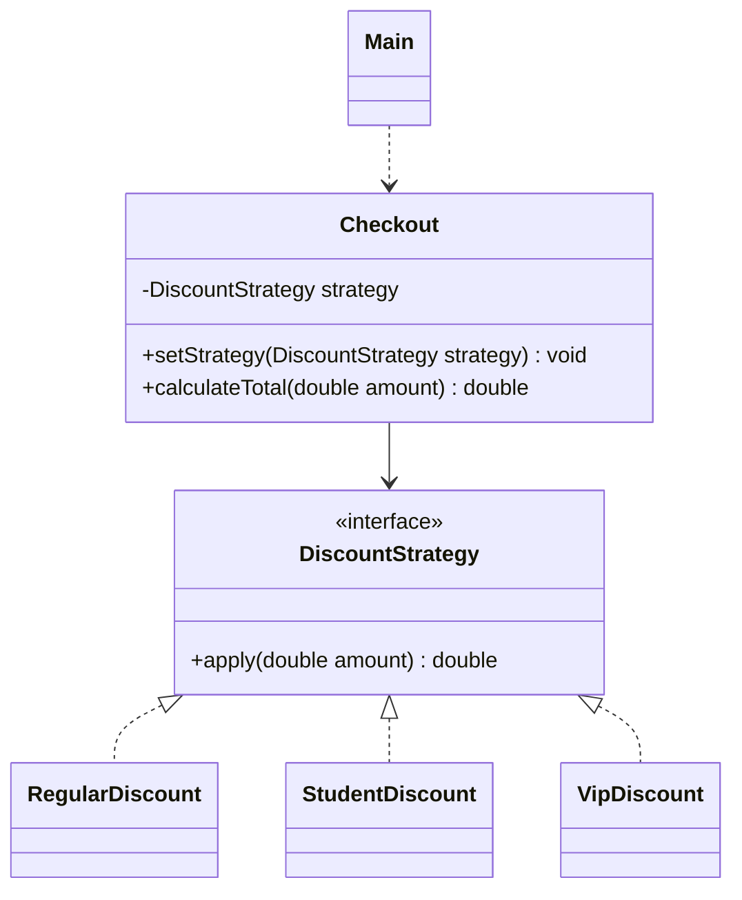
```mermaid
classDiagram
    class Main
    class DiscountStrategy {
        <<interface>>
        +apply(double amount) double
    }
    class RegularDiscount
    class StudentDiscount
    class VipDiscount
    class Checkout {
        -DiscountStrategy strategy
        +setStrategy(DiscountStrategy strategy) void
        +calculateTotal(double amount) double
    }
    DiscountStrategy <|.. RegularDiscount
    DiscountStrategy <|.. StudentDiscount
    DiscountStrategy <|.. VipDiscount
    Checkout --> DiscountStrategy
    Main ..> Checkout
```

```java
interface DiscountStrategy {
    double apply(double amount);
}

class RegularDiscount implements DiscountStrategy {
    public double apply(double amount) {
        return amount;
    }
}

class StudentDiscount implements DiscountStrategy {
    public double apply(double amount) {
        return amount * 0.90;
    }
}

class VipDiscount implements DiscountStrategy {
    public double apply(double amount) {
        return amount * 0.80;
    }
}

class Checkout {
    private DiscountStrategy strategy;

    public Checkout(DiscountStrategy strategy) {
        this.strategy = strategy;
    }

    public void setStrategy(DiscountStrategy strategy) {
        this.strategy = strategy;
    }

    public double calculateTotal(double amount) {
        return strategy.apply(amount);
    }
}

public class Main {
    public static void main(String[] args) {
        Checkout checkout = new Checkout(new RegularDiscount());
        System.out.println(checkout.calculateTotal(100));

        checkout.setStrategy(new StudentDiscount());
        System.out.println(checkout.calculateTotal(100));

        checkout.setStrategy(new VipDiscount());
        System.out.println(checkout.calculateTotal(100));
    }
}
```

---

# Part B — Medium Scenarios

## Question 3 — Notification Service

A company has a notification module. At first, it sends plain text notifications. Later, users may add optional features such as encryption, compression, and logging. These features can be combined in different orders. The original notification sender should not be modified every time a new optional feature is added.

Required:

- Choose the most suitable design pattern.
- Draw the UML diagram.
- Write the Java implementation.
- Include a `Main` class that sends a notification with at least two optional features added dynamically.

---

## Answer 3 - Notification Service

**Pattern:** Decorator

**Justification:** Encryption, compression, and logging are optional features that can be stacked dynamically without modifying the original sender.

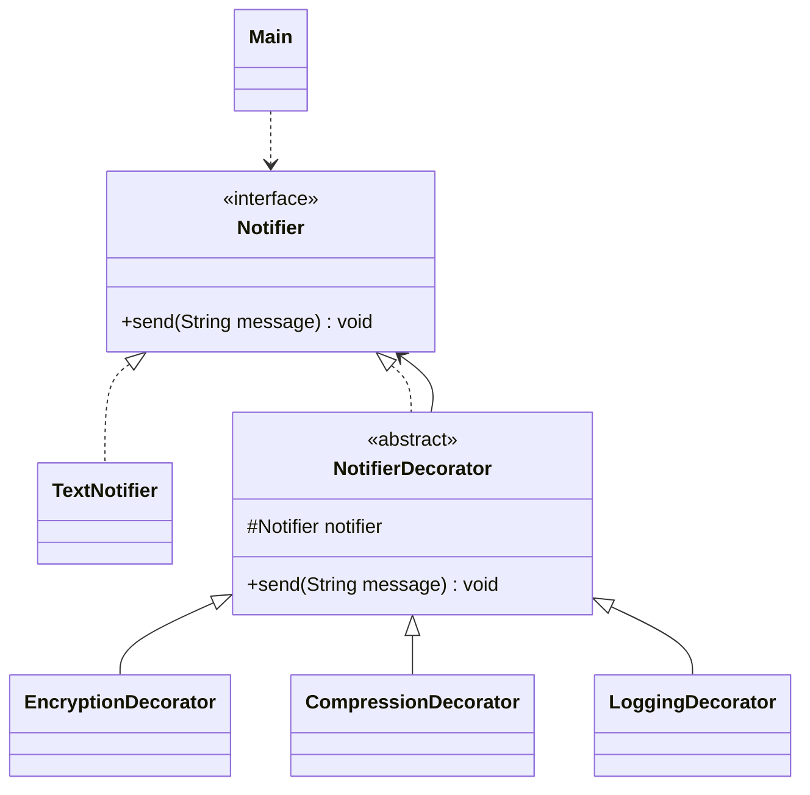
```mermaid
classDiagram
    class Main
    class Notifier {
        <<interface>>
        +send(String message) void
    }
    class TextNotifier
    class NotifierDecorator {
        <<abstract>>
        #Notifier notifier
        +send(String message) void
    }
    class EncryptionDecorator
    class CompressionDecorator
    class LoggingDecorator
    Notifier <|.. TextNotifier
    Notifier <|.. NotifierDecorator
    NotifierDecorator --> Notifier
    NotifierDecorator <|-- EncryptionDecorator
    NotifierDecorator <|-- CompressionDecorator
    NotifierDecorator <|-- LoggingDecorator
    Main ..> Notifier
```

```java
interface Notifier {
    void send(String message);
}

class TextNotifier implements Notifier {
    public void send(String message) {
        System.out.println("Sending: " + message);
    }
}

abstract class NotifierDecorator implements Notifier {
    protected final Notifier notifier;

    protected NotifierDecorator(Notifier notifier) {
        this.notifier = notifier;
    }
}

class EncryptionDecorator extends NotifierDecorator {
    public EncryptionDecorator(Notifier notifier) {
        super(notifier);
    }

    public void send(String message) {
        notifier.send("[encrypted] " + message);
    }
}

class CompressionDecorator extends NotifierDecorator {
    public CompressionDecorator(Notifier notifier) {
        super(notifier);
    }

    public void send(String message) {
        notifier.send("[compressed] " + message);
    }
}

class LoggingDecorator extends NotifierDecorator {
    public LoggingDecorator(Notifier notifier) {
        super(notifier);
    }

    public void send(String message) {
        System.out.println("Log: notification requested");
        notifier.send(message);
    }
}

public class Main {
    public static void main(String[] args) {
        Notifier notifier = new LoggingDecorator(
            new EncryptionDecorator(
                new CompressionDecorator(new TextNotifier())
            )
        );
        notifier.send("System update");
    }
}
```

---

## Question 4 — Report Exporter

A reporting system exports reports in several formats. The steps are mostly the same:

1. Read report data.
2. Format the report.
3. Save the report.

However, PDF, HTML, and CSV reports each format and save the report differently. The general algorithm should remain fixed, while some steps should be customized by subclasses.

Required:

- Choose the most suitable design pattern.
- Draw the UML diagram.
- Write the Java implementation.
- Include a `Main` class that exports at least two different report types.

---

## Answer 4 - Report Exporter

**Pattern:** Template Method

**Justification:** All report exporters follow the same algorithm, but formatting and saving differ by report type.

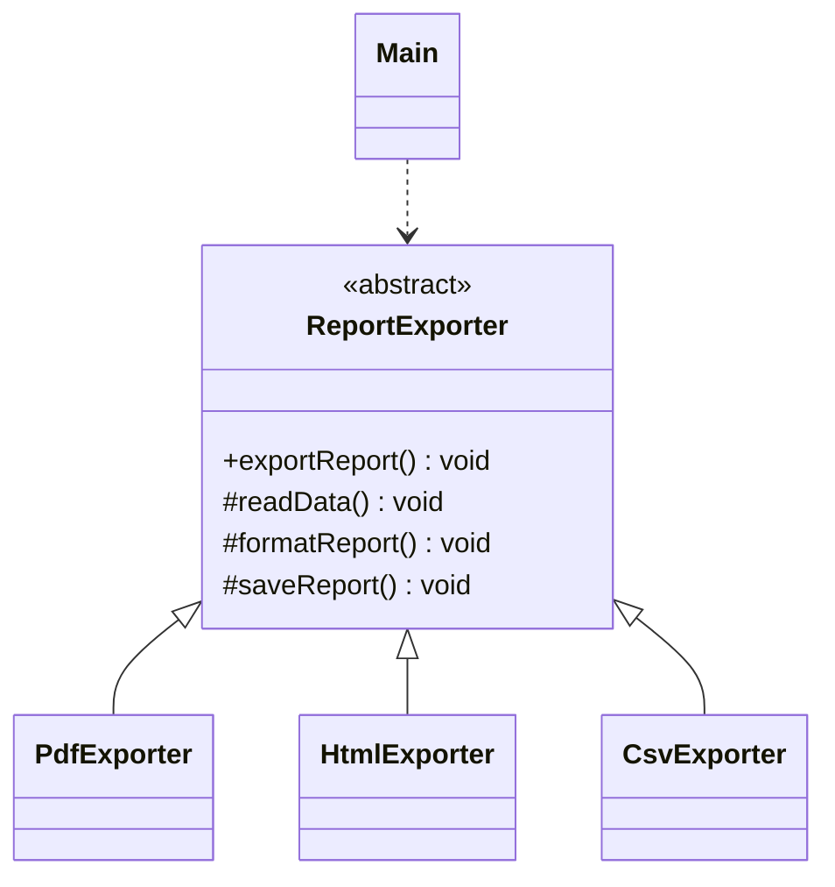
```mermaid
classDiagram
    class Main
    class ReportExporter {
        <<abstract>>
        +exportReport() void
        #readData() void
        #formatReport() void
        #saveReport() void
    }
    class PdfExporter
    class HtmlExporter
    class CsvExporter
    ReportExporter <|-- PdfExporter
    ReportExporter <|-- HtmlExporter
    ReportExporter <|-- CsvExporter
    Main ..> ReportExporter
```

```java
abstract class ReportExporter {
    public final void exportReport() {
        readData();
        formatReport();
        saveReport();
    }

    protected void readData() {
        System.out.println("Reading report data");
    }

    protected abstract void formatReport();
    protected abstract void saveReport();
}

class PdfExporter extends ReportExporter {
    protected void formatReport() {
        System.out.println("Formatting PDF report");
    }

    protected void saveReport() {
        System.out.println("Saving report.pdf");
    }
}

class HtmlExporter extends ReportExporter {
    protected void formatReport() {
        System.out.println("Formatting HTML report");
    }

    protected void saveReport() {
        System.out.println("Saving report.html");
    }
}

public class Main {
    public static void main(String[] args) {
        ReportExporter pdf = new PdfExporter();
        ReportExporter html = new HtmlExporter();

        pdf.exportReport();
        html.exportReport();
    }
}
```

---

## Question 5 — Legacy Printer Integration

A new document editor expects all printers to implement this method:

```java
void printDocument(String text);
```

However, the company already owns an old printer library with this method:

```java
void oldPrint(String data);
```

The old printer code cannot be changed. The new editor must use the old printer as if it followed the new interface.

Required:

- Choose the most suitable design pattern.
- Draw the UML diagram.
- Write the Java implementation.
- Include a `Main` class that prints a document through the new expected interface while internally using the old printer.

---

## Answer 5 - Legacy Printer Integration

**Pattern:** Adapter

**Justification:** The old printer has useful behavior but exposes an incompatible method. The adapter makes it usable through the new printer interface.

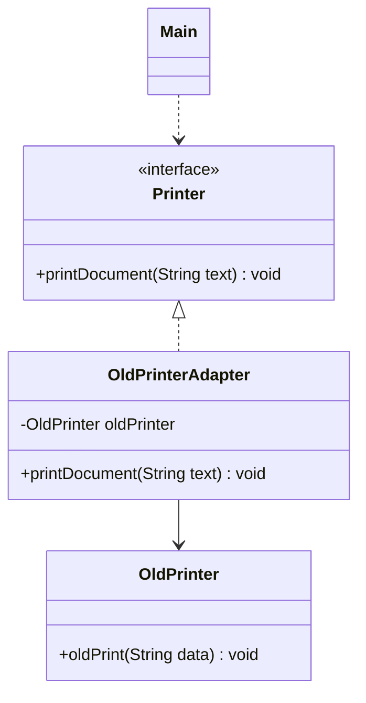
```mermaid
classDiagram
    class Main
    class Printer {
        <<interface>>
        +printDocument(String text) void
    }
    class OldPrinter {
        +oldPrint(String data) void
    }
    class OldPrinterAdapter {
        -OldPrinter oldPrinter
        +printDocument(String text) void
    }
    Printer <|.. OldPrinterAdapter
    OldPrinterAdapter --> OldPrinter
    Main ..> Printer
```

```java
interface Printer {
    void printDocument(String text);
}

class OldPrinter {
    public void oldPrint(String data) {
        System.out.println("Old printer: " + data);
    }
}

class OldPrinterAdapter implements Printer {
    private final OldPrinter oldPrinter;

    public OldPrinterAdapter(OldPrinter oldPrinter) {
        this.oldPrinter = oldPrinter;
    }

    public void printDocument(String text) {
        oldPrinter.oldPrint(text);
    }
}

public class Main {
    public static void main(String[] args) {
        Printer printer = new OldPrinterAdapter(new OldPrinter());
        printer.printDocument("Exam document");
    }
}
```

---

## Question 6 — GUI Toolkit Families

A cross-platform application must create buttons and checkboxes. On Windows, it should create Windows-style buttons and checkboxes. On macOS, it should create macOS-style buttons and checkboxes. The client code should not directly instantiate platform-specific UI classes.

Required:

- Choose the most suitable design pattern.
- Draw the UML diagram.
- Write the Java implementation.
- Include a `Main` class that creates UI elements for at least two platforms.

---

## Answer 6 - GUI Toolkit Families

**Pattern:** Abstract Factory

**Justification:** The system must create related families of UI products, such as Windows button with Windows checkbox and macOS button with macOS checkbox.

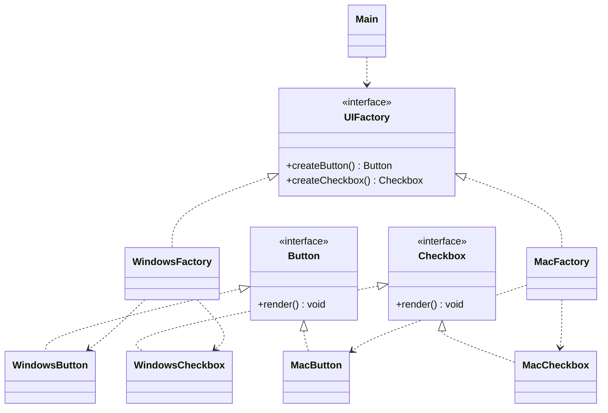
```mermaid
classDiagram
    class Main
    class UIFactory {
        <<interface>>
        +createButton() Button
        +createCheckbox() Checkbox
    }
    class WindowsFactory
    class MacFactory
    class WindowsButton
    class MacButton
    class WindowsCheckbox
    class MacCheckbox
    class Button {
        <<interface>>
        +render() void
    }
    class Checkbox {
        <<interface>>
        +render() void
    }
    UIFactory <|.. WindowsFactory
    UIFactory <|.. MacFactory
    Button <|.. WindowsButton
    Button <|.. MacButton
    Checkbox <|.. WindowsCheckbox
    Checkbox <|.. MacCheckbox
    WindowsFactory ..> WindowsButton
    WindowsFactory ..> WindowsCheckbox
    MacFactory ..> MacButton
    MacFactory ..> MacCheckbox
    Main ..> UIFactory
```

```java
interface Button {
    void render();
}

interface Checkbox {
    void render();
}

class WindowsButton implements Button {
    public void render() {
        System.out.println("Windows button");
    }
}

class WindowsCheckbox implements Checkbox {
    public void render() {
        System.out.println("Windows checkbox");
    }
}

class MacButton implements Button {
    public void render() {
        System.out.println("macOS button");
    }
}

class MacCheckbox implements Checkbox {
    public void render() {
        System.out.println("macOS checkbox");
    }
}

interface UIFactory {
    Button createButton();
    Checkbox createCheckbox();
}

class WindowsFactory implements UIFactory {
    public Button createButton() {
        return new WindowsButton();
    }

    public Checkbox createCheckbox() {
        return new WindowsCheckbox();
    }
}

class MacFactory implements UIFactory {
    public Button createButton() {
        return new MacButton();
    }

    public Checkbox createCheckbox() {
        return new MacCheckbox();
    }
}

public class Main {
    private static void renderUI(UIFactory factory) {
        factory.createButton().render();
        factory.createCheckbox().render();
    }

    public static void main(String[] args) {
        renderUI(new WindowsFactory());
        renderUI(new MacFactory());
    }
}
```

---

## Question 7 — News Subscription System

A news agency publishes breaking news. Many subscribers, such as mobile apps, email services, and website dashboards, must automatically receive updates when new news is published. The publisher should not need to know the concrete classes of all subscribers.

Required:

- Choose the most suitable design pattern.
- Draw the UML diagram.
- Write the Java implementation.
- Include a `Main` class where multiple subscribers receive a news update.

---

## Answer 7 - News Subscription System

**Pattern:** Observer

**Justification:** Subscribers must automatically receive updates when the news agency publishes breaking news, while the publisher depends only on the subscriber abstraction.

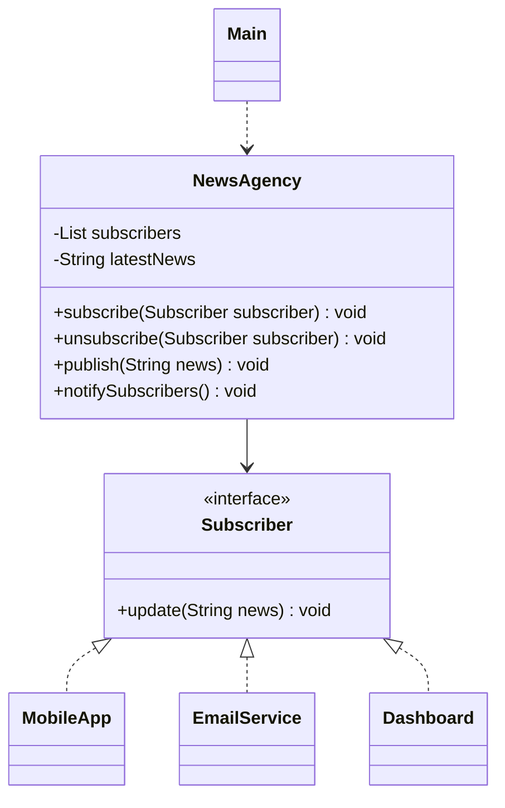
```mermaid
classDiagram
    class Main
    class Subscriber {
        <<interface>>
        +update(String news) void
    }
    class NewsAgency {
        -List subscribers
        -String latestNews
        +subscribe(Subscriber subscriber) void
        +unsubscribe(Subscriber subscriber) void
        +publish(String news) void
        +notifySubscribers() void
    }
    class MobileApp
    class EmailService
    class Dashboard
    Subscriber <|.. MobileApp
    Subscriber <|.. EmailService
    Subscriber <|.. Dashboard
    NewsAgency --> Subscriber
    Main ..> NewsAgency
```

```java
import java.util.ArrayList;
import java.util.List;

interface Subscriber {
    void update(String news);
}

class NewsAgency {
    private final List<Subscriber> subscribers = new ArrayList<>();
    private String latestNews;

    public void subscribe(Subscriber subscriber) {
        subscribers.add(subscriber);
    }

    public void unsubscribe(Subscriber subscriber) {
        subscribers.remove(subscriber);
    }

    public void publish(String news) {
        latestNews = news;
        notifySubscribers();
    }

    private void notifySubscribers() {
        for (Subscriber subscriber : subscribers) {
            subscriber.update(latestNews);
        }
    }
}

class MobileApp implements Subscriber {
    public void update(String news) {
        System.out.println("Mobile app received: " + news);
    }
}

class EmailService implements Subscriber {
    public void update(String news) {
        System.out.println("Email service received: " + news);
    }
}

class Dashboard implements Subscriber {
    public void update(String news) {
        System.out.println("Dashboard received: " + news);
    }
}

public class Main {
    public static void main(String[] args) {
        NewsAgency agency = new NewsAgency();
        agency.subscribe(new MobileApp());
        agency.subscribe(new EmailService());
        agency.subscribe(new Dashboard());
        agency.publish("Breaking news published");
    }
}
```

---

## Question 8 — Shape Drawing System

A drawing application supports different shapes such as circles and rectangles. It also supports different rendering technologies such as raster rendering and vector rendering. The system should allow adding new shapes without changing renderer classes, and adding new renderers without changing shape classes.

Required:

- Choose the most suitable design pattern.
- Draw the UML diagram.
- Write the Java implementation.
- Include a `Main` class that draws at least two shapes using different renderers.

---

## Answer 8 - Shape Drawing System

**Pattern:** Bridge

**Justification:** Shapes and renderers are two independent dimensions of variation. Bridge avoids creating a class for every shape-renderer combination.

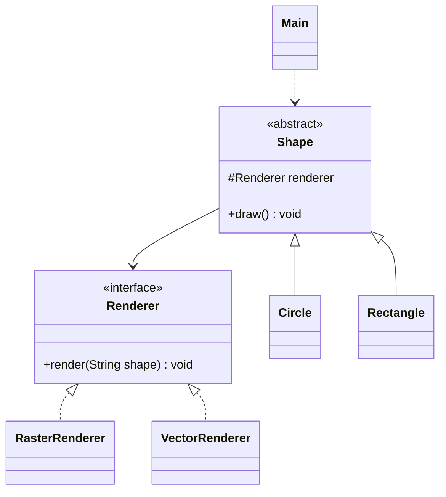
```mermaid
classDiagram
    class Main
    class Renderer {
        <<interface>>
        +render(String shape) void
    }
    class RasterRenderer
    class VectorRenderer
    class Shape {
        <<abstract>>
        #Renderer renderer
        +draw() void
    }
    class Circle
    class Rectangle
    Renderer <|.. RasterRenderer
    Renderer <|.. VectorRenderer
    Shape <|-- Circle
    Shape <|-- Rectangle
    Shape --> Renderer
    Main ..> Shape
```

```java
interface Renderer {
    void render(String shape);
}

class RasterRenderer implements Renderer {
    public void render(String shape) {
        System.out.println("Drawing " + shape + " as pixels");
    }
}

class VectorRenderer implements Renderer {
    public void render(String shape) {
        System.out.println("Drawing " + shape + " as vectors");
    }
}

abstract class Shape {
    protected final Renderer renderer;

    protected Shape(Renderer renderer) {
        this.renderer = renderer;
    }

    public abstract void draw();
}

class Circle extends Shape {
    public Circle(Renderer renderer) {
        super(renderer);
    }

    public void draw() {
        renderer.render("circle");
    }
}

class Rectangle extends Shape {
    public Rectangle(Renderer renderer) {
        super(renderer);
    }

    public void draw() {
        renderer.render("rectangle");
    }
}

public class Main {
    public static void main(String[] args) {
        Shape circle = new Circle(new VectorRenderer());
        Shape rectangle = new Rectangle(new RasterRenderer());
        circle.draw();
        rectangle.draw();
    }
}
```

---

## Question 9 — Chat Room

A chat application has many users. If each user directly stores references to all other users, communication becomes complex. The system needs one object that coordinates message sending between users. Users should send messages through this coordinator instead of communicating directly with each other.

Required:

- Choose the most suitable design pattern.
- Draw the UML diagram.
- Write the Java implementation.
- Include a `Main` class where users send messages through the coordinator.

---

## Answer 9 - Chat Room

**Pattern:** Mediator

**Justification:** A central chat room coordinates communication so users do not need direct references to every other user.

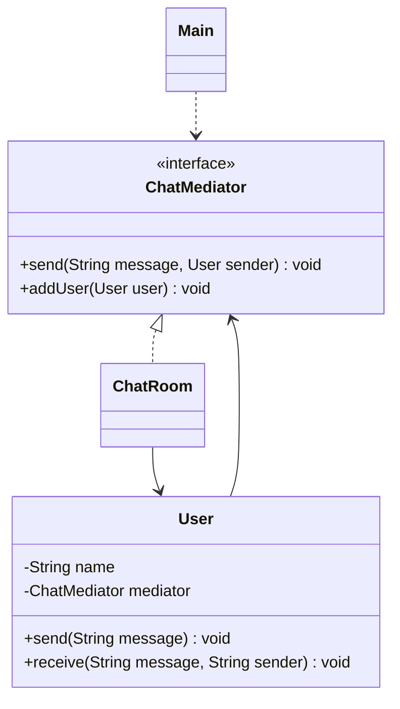
```mermaid
classDiagram
    class Main
    class ChatMediator {
        <<interface>>
        +send(String message, User sender) void
        +addUser(User user) void
    }
    class ChatRoom
    class User {
        -String name
        -ChatMediator mediator
        +send(String message) void
        +receive(String message, String sender) void
    }
    ChatMediator <|.. ChatRoom
    User --> ChatMediator
    ChatRoom --> User
    Main ..> ChatMediator
```

```java
import java.util.ArrayList;
import java.util.List;

interface ChatMediator {
    void send(String message, User sender);
    void addUser(User user);
}

class ChatRoom implements ChatMediator {
    private final List<User> users = new ArrayList<>();

    public void addUser(User user) {
        users.add(user);
    }

    public void send(String message, User sender) {
        for (User user : users) {
            if (user != sender) {
                user.receive(message, sender.getName());
            }
        }
    }
}

class User {
    private final String name;
    private final ChatMediator mediator;

    public User(String name, ChatMediator mediator) {
        this.name = name;
        this.mediator = mediator;
    }

    public String getName() {
        return name;
    }

    public void send(String message) {
        mediator.send(message, this);
    }

    public void receive(String message, String sender) {
        System.out.println(name + " received from " + sender + ": " + message);
    }
}

public class Main {
    public static void main(String[] args) {
        ChatMediator room = new ChatRoom();
        User ahmed = new User("Ahmed", room);
        User sara = new User("Sara", room);
        User ali = new User("Ali", room);
        room.addUser(ahmed);
        room.addUser(sara);
        room.addUser(ali);
        ahmed.send("Hello everyone");
    }
}
```

---

## Question 10 — Product Creation Based on Type

A logistics application creates different transport objects. If the user chooses road delivery, the system creates a truck. If the user chooses sea delivery, it creates a ship. The client code should work with a common transport interface and should not directly instantiate concrete transport classes everywhere.

Required:

- Choose the most suitable design pattern.
- Draw the UML diagram.
- Write the Java implementation.
- Include a `Main` class that creates at least two types of transport and calls their delivery behavior.

---

## Answer 10 - Product Creation Based on Type

**Pattern:** Factory Method

**Justification:** The client works with the `Transport` abstraction, while concrete creator classes decide which transport object to create.

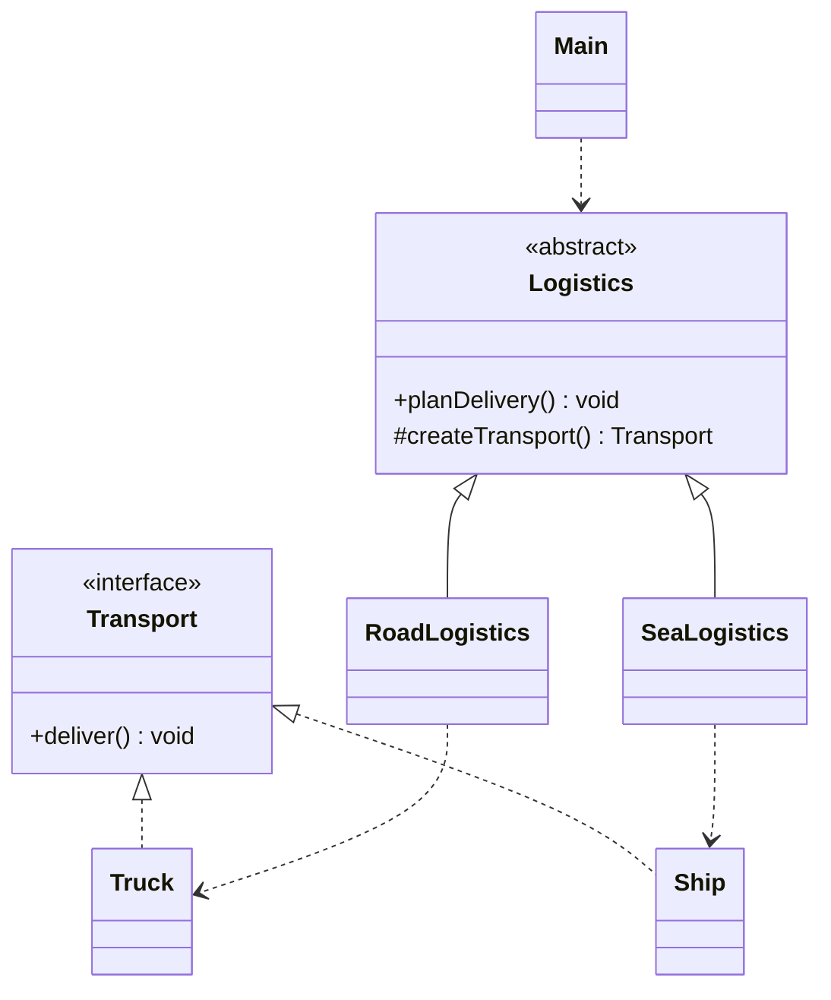
```mermaid
classDiagram
    class Main
    class Transport {
        <<interface>>
        +deliver() void
    }
    class Truck
    class Ship
    class Logistics {
        <<abstract>>
        +planDelivery() void
        #createTransport() Transport
    }
    class RoadLogistics
    class SeaLogistics
    Transport <|.. Truck
    Transport <|.. Ship
    Logistics <|-- RoadLogistics
    Logistics <|-- SeaLogistics
    RoadLogistics ..> Truck
    SeaLogistics ..> Ship
    Main ..> Logistics
```

```java
interface Transport {
    void deliver();
}

class Truck implements Transport {
    public void deliver() {
        System.out.println("Delivering by road in a truck");
    }
}

class Ship implements Transport {
    public void deliver() {
        System.out.println("Delivering by sea in a ship");
    }
}

abstract class Logistics {
    public void planDelivery() {
        Transport transport = createTransport();
        transport.deliver();
    }

    protected abstract Transport createTransport();
}

class RoadLogistics extends Logistics {
    protected Transport createTransport() {
        return new Truck();
    }
}

class SeaLogistics extends Logistics {
    protected Transport createTransport() {
        return new Ship();
    }
}

public class Main {
    public static void main(String[] args) {
        Logistics road = new RoadLogistics();
        Logistics sea = new SeaLogistics();
        road.planDelivery();
        sea.planDelivery();
    }
}
```

---

## Question 11 — Library Book Collection

A digital library stores books internally in an array list. Client code needs to access the books one by one without knowing how the collection is stored. Later, the library may change its internal storage from an array list to another structure, but client traversal code should remain stable.

Required:

- Choose the most suitable design pattern.
- Draw the UML diagram.
- Write the Java implementation.
- Include a `Main` class that traverses and prints all books without exposing the collection’s internal representation.

---

## Answer 11 - Library Book Collection

**Pattern:** Iterator

**Justification:** Client code can traverse books one by one without depending on the library's internal storage structure.

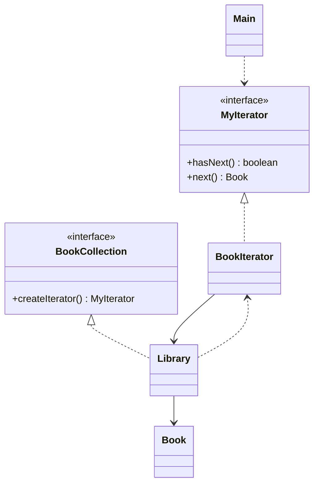
```mermaid
classDiagram
    class Main
    class MyIterator {
        <<interface>>
        +hasNext() boolean
        +next() Book
    }
    class BookIterator
    class BookCollection {
        <<interface>>
        +createIterator() MyIterator
    }
    class Library
    class Book
    MyIterator <|.. BookIterator
    BookCollection <|.. Library
    Library --> Book
    Library ..> BookIterator
    BookIterator --> Library
    Main ..> MyIterator
```

```java
import java.util.ArrayList;
import java.util.List;

class Book {
    private final String title;

    public Book(String title) {
        this.title = title;
    }

    public String getTitle() {
        return title;
    }
}

interface MyIterator<T> {
    boolean hasNext();
    T next();
}

interface BookCollection {
    MyIterator<Book> createIterator();
}

class Library implements BookCollection {
    private final List<Book> books = new ArrayList<>();

    public void addBook(Book book) {
        books.add(book);
    }

    public Book getBookAt(int index) {
        return books.get(index);
    }

    public int size() {
        return books.size();
    }

    public MyIterator<Book> createIterator() {
        return new BookIterator(this);
    }
}

class BookIterator implements MyIterator<Book> {
    private final Library library;
    private int index;

    public BookIterator(Library library) {
        this.library = library;
    }

    public boolean hasNext() {
        return index < library.size();
    }

    public Book next() {
        return library.getBookAt(index++);
    }
}

public class Main {
    public static void main(String[] args) {
        Library library = new Library();
        library.addBook(new Book("Design Patterns"));
        library.addBook(new Book("Clean Code"));

        MyIterator<Book> iterator = library.createIterator();
        while (iterator.hasNext()) {
            System.out.println(iterator.next().getTitle());
        }
    }
}
```

---

## Question 12 — Text Formatting Options

A text editor starts with a simple text object. Users can add bold, italic, underline, or border effects at runtime. These formatting features should be stackable. For example, one text object may be bold and italic, while another may be underlined only.

Required:

- Choose the most suitable design pattern.
- Draw the UML diagram.
- Write the Java implementation.
- Include a `Main` class showing at least two different combinations of formatting features.

---

## Answer 12 - Text Formatting Options

**Pattern:** Decorator

**Justification:** Formatting effects are optional and stackable. Decorator avoids creating subclasses for every formatting combination.

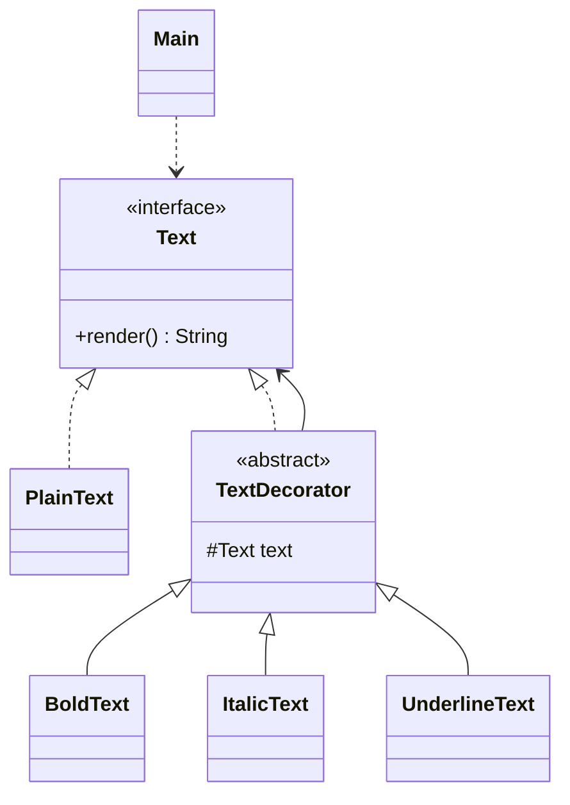
```mermaid
classDiagram
    class Main
    class Text {
        <<interface>>
        +render() String
    }
    class PlainText
    class TextDecorator {
        <<abstract>>
        #Text text
    }
    class BoldText
    class ItalicText
    class UnderlineText
    Text <|.. PlainText
    Text <|.. TextDecorator
    TextDecorator --> Text
    TextDecorator <|-- BoldText
    TextDecorator <|-- ItalicText
    TextDecorator <|-- UnderlineText
    Main ..> Text
```

```java
interface Text {
    String render();
}

class PlainText implements Text {
    private final String value;

    public PlainText(String value) {
        this.value = value;
    }

    public String render() {
        return value;
    }
}

abstract class TextDecorator implements Text {
    protected final Text text;

    protected TextDecorator(Text text) {
        this.text = text;
    }
}

class BoldText extends TextDecorator {
    public BoldText(Text text) {
        super(text);
    }

    public String render() {
        return "<b>" + text.render() + "</b>";
    }
}

class ItalicText extends TextDecorator {
    public ItalicText(Text text) {
        super(text);
    }

    public String render() {
        return "<i>" + text.render() + "</i>";
    }
}

class UnderlineText extends TextDecorator {
    public UnderlineText(Text text) {
        super(text);
    }

    public String render() {
        return "<u>" + text.render() + "</u>";
    }
}

public class Main {
    public static void main(String[] args) {
        Text boldItalic = new BoldText(new ItalicText(new PlainText("Hello")));
        Text underline = new UnderlineText(new PlainText("Exam"));

        System.out.println(boldItalic.render());
        System.out.println(underline.render());
    }
}
```

---

# Part C — Hard Scenarios

## Question 13 — Map Marker Rendering

A map application displays thousands of markers. Many markers share the same icon, color, and label style, but each marker has a different latitude and longitude. Creating a full object with duplicated icon and style data for every marker wastes memory. The system should share common marker data while keeping location-specific data separate.

Required:

- Choose the most suitable design pattern.
- Draw the UML diagram.
- Write the Java implementation.
- Include a `Main` class that creates many markers while reusing shared style objects.

---

## Answer 13 - Map Marker Rendering

**Pattern:** Flyweight

**Justification:** Shared marker style data is intrinsic state and location is extrinsic state. Flyweight stores common style once and reuses it.

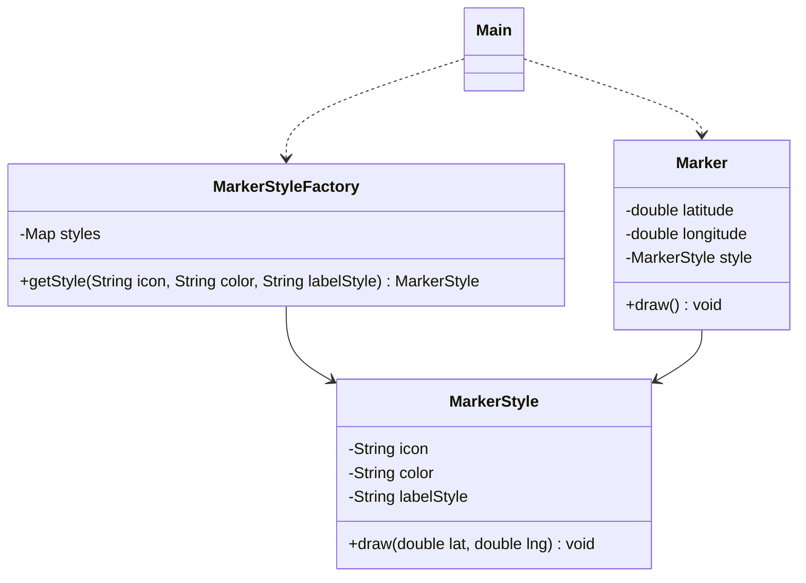
```mermaid
classDiagram
    class Main
    class MarkerStyle {
        -String icon
        -String color
        -String labelStyle
        +draw(double lat, double lng) void
    }
    class MarkerStyleFactory {
        -Map styles
        +getStyle(String icon, String color, String labelStyle) MarkerStyle
    }
    class Marker {
        -double latitude
        -double longitude
        -MarkerStyle style
        +draw() void
    }
    MarkerStyleFactory --> MarkerStyle
    Marker --> MarkerStyle
    Main ..> MarkerStyleFactory
    Main ..> Marker
```

```java
import java.util.HashMap;
import java.util.Map;

class MarkerStyle {
    private final String icon;
    private final String color;
    private final String labelStyle;

    public MarkerStyle(String icon, String color, String labelStyle) {
        this.icon = icon;
        this.color = color;
        this.labelStyle = labelStyle;
    }

    public void draw(double latitude, double longitude) {
        System.out.println(icon + " " + color + " " + labelStyle +
            " at " + latitude + ", " + longitude);
    }
}

class MarkerStyleFactory {
    private static final Map<String, MarkerStyle> styles = new HashMap<>();

    public static MarkerStyle getStyle(String icon, String color, String labelStyle) {
        String key = icon + "-" + color + "-" + labelStyle;
        styles.putIfAbsent(key, new MarkerStyle(icon, color, labelStyle));
        return styles.get(key);
    }
}

class Marker {
    private final double latitude;
    private final double longitude;
    private final MarkerStyle style;

    public Marker(double latitude, double longitude, MarkerStyle style) {
        this.latitude = latitude;
        this.longitude = longitude;
        this.style = style;
    }

    public void draw() {
        style.draw(latitude, longitude);
    }
}

public class Main {
    public static void main(String[] args) {
        MarkerStyle restaurant = MarkerStyleFactory.getStyle("pin", "red", "bold");
        MarkerStyle sameRestaurant = MarkerStyleFactory.getStyle("pin", "red", "bold");

        new Marker(30.1, 31.2, restaurant).draw();
        new Marker(30.2, 31.3, sameRestaurant).draw();

        System.out.println(restaurant == sameRestaurant);
    }
}
```

---

## Question 14 — Game Enemy Creation

A game creates different enemy objects depending on the level. Forest levels create wolves and archers. Desert levels create scorpions and sand warriors. Each level should create a related family of enemies that belong together. The game engine should not directly instantiate individual enemy classes.

Required:

- Choose the most suitable design pattern.
- Draw the UML diagram.
- Write the Java implementation.
- Include a `Main` class that creates enemy families for at least two different levels.

---

## Answer 14 - Game Enemy Creation

**Pattern:** Abstract Factory

**Justification:** Each level creates a related family of enemies. The game engine uses an abstract factory instead of directly creating concrete enemies.

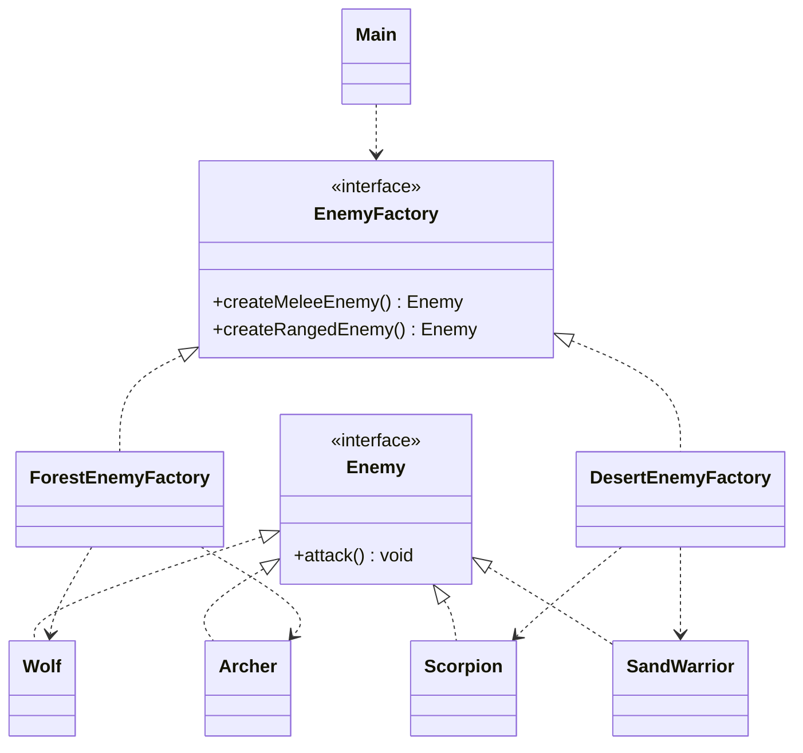
```mermaid
classDiagram
    class Main
    class EnemyFactory {
        <<interface>>
        +createMeleeEnemy() Enemy
        +createRangedEnemy() Enemy
    }
    class ForestEnemyFactory
    class DesertEnemyFactory
    class Wolf
    class Archer
    class Scorpion
    class SandWarrior
    class Enemy {
        <<interface>>
        +attack() void
    }
    EnemyFactory <|.. ForestEnemyFactory
    EnemyFactory <|.. DesertEnemyFactory
    Enemy <|.. Wolf
    Enemy <|.. Archer
    Enemy <|.. Scorpion
    Enemy <|.. SandWarrior
    ForestEnemyFactory ..> Wolf
    ForestEnemyFactory ..> Archer
    DesertEnemyFactory ..> Scorpion
    DesertEnemyFactory ..> SandWarrior
    Main ..> EnemyFactory
```

```java
interface Enemy {
    void attack();
}

class Wolf implements Enemy {
    public void attack() {
        System.out.println("Wolf bites");
    }
}

class Archer implements Enemy {
    public void attack() {
        System.out.println("Archer shoots");
    }
}

class Scorpion implements Enemy {
    public void attack() {
        System.out.println("Scorpion stings");
    }
}

class SandWarrior implements Enemy {
    public void attack() {
        System.out.println("Sand warrior strikes");
    }
}

interface EnemyFactory {
    Enemy createMeleeEnemy();
    Enemy createRangedEnemy();
}

class ForestEnemyFactory implements EnemyFactory {
    public Enemy createMeleeEnemy() {
        return new Wolf();
    }

    public Enemy createRangedEnemy() {
        return new Archer();
    }
}

class DesertEnemyFactory implements EnemyFactory {
    public Enemy createMeleeEnemy() {
        return new Scorpion();
    }

    public Enemy createRangedEnemy() {
        return new SandWarrior();
    }
}

public class Main {
    private static void spawnLevel(EnemyFactory factory) {
        factory.createMeleeEnemy().attack();
        factory.createRangedEnemy().attack();
    }

    public static void main(String[] args) {
        spawnLevel(new ForestEnemyFactory());
        spawnLevel(new DesertEnemyFactory());
    }
}
```

---

## Question 15 — Sorting Module

A data analysis program allows users to sort datasets using different algorithms. Small datasets may use insertion sort, large datasets may use merge sort, and nearly sorted datasets may use bubble sort. The selected algorithm should be changeable at runtime without modifying the dataset class.

Required:

- Choose the most suitable design pattern.
- Draw the UML diagram.
- Write the Java implementation.
- Include a `Main` class that switches between at least two sorting algorithms at runtime.

---

## Answer 15 - Sorting Module

**Pattern:** Strategy

**Justification:** Sorting algorithms are interchangeable strategies that can be selected at runtime without changing the dataset class.

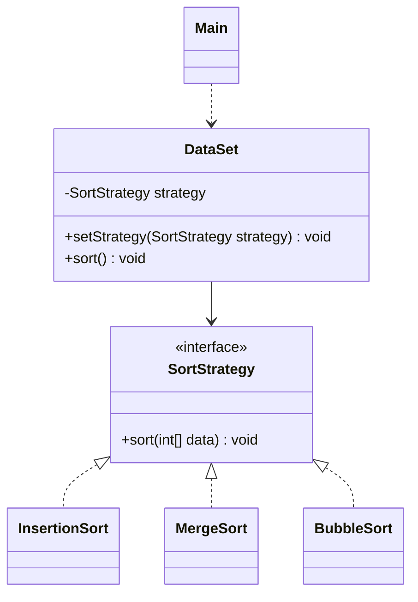
```mermaid
classDiagram
    class Main
    class SortStrategy {
        <<interface>>
        +sort(int[] data) void
    }
    class InsertionSort
    class MergeSort
    class BubbleSort
    class DataSet {
        -SortStrategy strategy
        +setStrategy(SortStrategy strategy) void
        +sort() void
    }
    SortStrategy <|.. InsertionSort
    SortStrategy <|.. MergeSort
    SortStrategy <|.. BubbleSort
    DataSet --> SortStrategy
    Main ..> DataSet
```

```java
interface SortStrategy {
    void sort(int[] data);
}

class InsertionSort implements SortStrategy {
    public void sort(int[] data) {
        System.out.println("Sorting using insertion sort");
    }
}

class MergeSort implements SortStrategy {
    public void sort(int[] data) {
        System.out.println("Sorting using merge sort");
    }
}

class BubbleSort implements SortStrategy {
    public void sort(int[] data) {
        System.out.println("Sorting using bubble sort");
    }
}

class DataSet {
    private final int[] data;
    private SortStrategy strategy;

    public DataSet(int[] data, SortStrategy strategy) {
        this.data = data;
        this.strategy = strategy;
    }

    public void setStrategy(SortStrategy strategy) {
        this.strategy = strategy;
    }

    public void sort() {
        strategy.sort(data);
    }
}

public class Main {
    public static void main(String[] args) {
        DataSet dataSet = new DataSet(new int[] {5, 2, 9}, new InsertionSort());
        dataSet.sort();
        dataSet.setStrategy(new MergeSort());
        dataSet.sort();
    }
}
```

---

## Question 16 — Online Course Workflow

An online learning platform has a general workflow for publishing a course:

1. Validate course information.
2. Upload course files.
3. Generate preview.
4. Publish course.

Different course types have special behavior. A video course generates a video preview, while a text course generates a sample reading preview. The overall publishing order must remain the same for all course types.

Required:

- Choose the most suitable design pattern.
- Draw the UML diagram.
- Write the Java implementation.
- Include a `Main` class that publishes at least two course types.

---

## Answer 16 - Online Course Workflow

**Pattern:** Template Method

**Justification:** Course publishing has a fixed sequence, but each course type customizes preview generation.

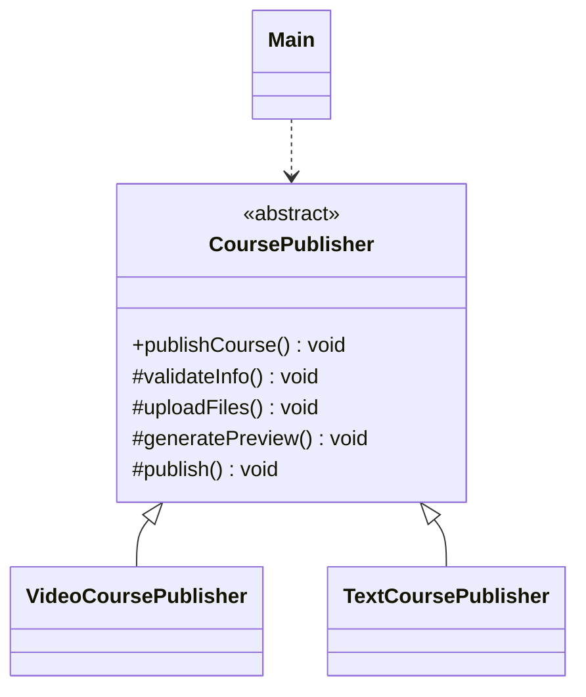
```mermaid
classDiagram
    class Main
    class CoursePublisher {
        <<abstract>>
        +publishCourse() void
        #validateInfo() void
        #uploadFiles() void
        #generatePreview() void
        #publish() void
    }
    class VideoCoursePublisher
    class TextCoursePublisher
    CoursePublisher <|-- VideoCoursePublisher
    CoursePublisher <|-- TextCoursePublisher
    Main ..> CoursePublisher
```

```java
abstract class CoursePublisher {
    public final void publishCourse() {
        validateInfo();
        uploadFiles();
        generatePreview();
        publish();
    }

    protected void validateInfo() {
        System.out.println("Validating course information");
    }

    protected void uploadFiles() {
        System.out.println("Uploading course files");
    }

    protected abstract void generatePreview();

    protected void publish() {
        System.out.println("Publishing course");
    }
}

class VideoCoursePublisher extends CoursePublisher {
    protected void generatePreview() {
        System.out.println("Generating video preview");
    }
}

class TextCoursePublisher extends CoursePublisher {
    protected void generatePreview() {
        System.out.println("Generating sample reading preview");
    }
}

public class Main {
    public static void main(String[] args) {
        new VideoCoursePublisher().publishCourse();
        new TextCoursePublisher().publishCourse();
    }
}
```

---

## Question 17 — Smart Home Controller

A smart home system includes lights, air conditioners, door locks, and alarms. If each device communicates directly with every other device, the system becomes difficult to maintain. The system needs a central coordinator that receives events and decides what other devices should do. For example, when the alarm is triggered, the doors lock and lights turn on.

Required:

- Choose the most suitable design pattern.
- Draw the UML diagram.
- Write the Java implementation.
- Include a `Main` class that triggers one event and shows multiple devices responding through the coordinator.

---

## Answer 17 - Smart Home Controller

**Pattern:** Mediator

**Justification:** A central coordinator receives events and tells devices how to respond, preventing direct device-to-device coupling.

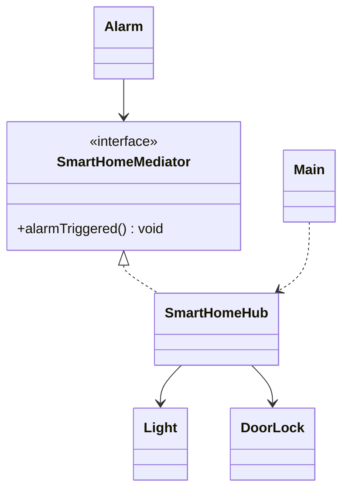
```mermaid
classDiagram
    class Main
    class SmartHomeMediator {
        <<interface>>
        +alarmTriggered() void
    }
    class SmartHomeHub
    class Light
    class DoorLock
    class Alarm
    SmartHomeMediator <|.. SmartHomeHub
    SmartHomeHub --> Light
    SmartHomeHub --> DoorLock
    Alarm --> SmartHomeMediator
    Main ..> SmartHomeHub
```

```java
interface SmartHomeMediator {
    void alarmTriggered();
}

class Light {
    public void turnOn() {
        System.out.println("Lights turned on");
    }
}

class DoorLock {
    public void lock() {
        System.out.println("Doors locked");
    }
}

class SmartHomeHub implements SmartHomeMediator {
    private final Light light;
    private final DoorLock doorLock;

    public SmartHomeHub(Light light, DoorLock doorLock) {
        this.light = light;
        this.doorLock = doorLock;
    }

    public void alarmTriggered() {
        doorLock.lock();
        light.turnOn();
    }
}

class Alarm {
    private final SmartHomeMediator mediator;

    public Alarm(SmartHomeMediator mediator) {
        this.mediator = mediator;
    }

    public void trigger() {
        System.out.println("Alarm triggered");
        mediator.alarmTriggered();
    }
}

public class Main {
    public static void main(String[] args) {
        SmartHomeHub hub = new SmartHomeHub(new Light(), new DoorLock());
        Alarm alarm = new Alarm(hub);
        alarm.trigger();
    }
}
```

---

## Question 18 — Image Loading Service

An image editing application can load images from different sources: local files, cloud storage, and URLs. The application wants to call one common method to load an image, but each source has a different class and different loading method. Some source classes are external libraries and cannot be modified.

Required:

- Choose the most suitable design pattern.
- Draw the UML diagram.
- Write the Java implementation.
- Include a `Main` class that loads images from at least two incompatible sources through one common interface.

---

## Answer 18 - Image Loading Service

**Pattern:** Adapter

**Justification:** The application needs one common image-loading interface while each external source exposes a different incompatible method.

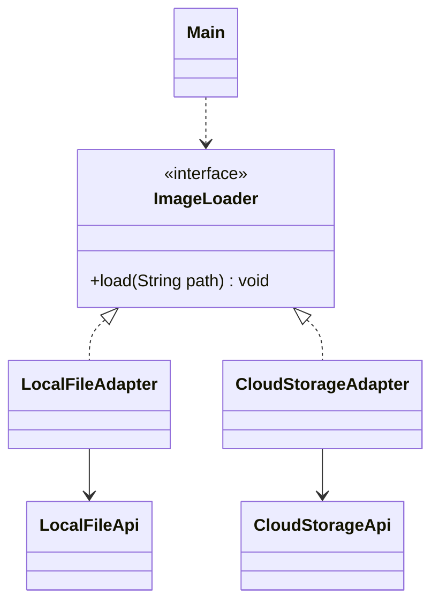
```mermaid
classDiagram
    class Main
    class ImageLoader {
        <<interface>>
        +load(String path) void
    }
    class LocalFileApi
    class CloudStorageApi
    class LocalFileAdapter
    class CloudStorageAdapter
    ImageLoader <|.. LocalFileAdapter
    ImageLoader <|.. CloudStorageAdapter
    LocalFileAdapter --> LocalFileApi
    CloudStorageAdapter --> CloudStorageApi
    Main ..> ImageLoader
```

```java
interface ImageLoader {
    void load(String source);
}

class LocalFileApi {
    public void openFile(String filePath) {
        System.out.println("Loading local file: " + filePath);
    }
}

class CloudStorageApi {
    public void downloadImage(String cloudKey) {
        System.out.println("Loading cloud image: " + cloudKey);
    }
}

class LocalFileAdapter implements ImageLoader {
    private final LocalFileApi api = new LocalFileApi();

    public void load(String source) {
        api.openFile(source);
    }
}

class CloudStorageAdapter implements ImageLoader {
    private final CloudStorageApi api = new CloudStorageApi();

    public void load(String source) {
        api.downloadImage(source);
    }
}

public class Main {
    public static void main(String[] args) {
        ImageLoader local = new LocalFileAdapter();
        ImageLoader cloud = new CloudStorageAdapter();
        local.load("photo.png");
        cloud.load("images/photo.png");
    }
}
```

---

## Question 19 — Banking Alerts

A bank account system must notify different services whenever an account balance changes. Fraud detection, SMS notification, email notification, and account history modules may all react to the change. These modules should be attachable and removable without changing the bank account class each time.

Required:

- Choose the most suitable design pattern.
- Draw the UML diagram.
- Write the Java implementation.
- Include a `Main` class that attaches multiple services, changes the balance, and shows the services receiving the update.

---

## Answer 19 - Banking Alerts

**Pattern:** Observer

**Justification:** Fraud detection, SMS, email, and history modules are observers that react automatically when the account balance changes.

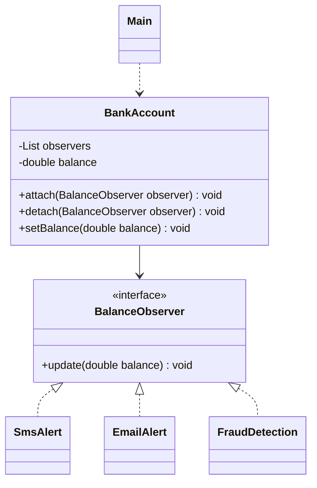
```mermaid
classDiagram
    class Main
    class BalanceObserver {
        <<interface>>
        +update(double balance) void
    }
    class BankAccount {
        -List observers
        -double balance
        +attach(BalanceObserver observer) void
        +detach(BalanceObserver observer) void
        +setBalance(double balance) void
    }
    class SmsAlert
    class EmailAlert
    class FraudDetection
    BalanceObserver <|.. SmsAlert
    BalanceObserver <|.. EmailAlert
    BalanceObserver <|.. FraudDetection
    BankAccount --> BalanceObserver
    Main ..> BankAccount
```

```java
import java.util.ArrayList;
import java.util.List;

interface BalanceObserver {
    void update(double balance);
}

class BankAccount {
    private final List<BalanceObserver> observers = new ArrayList<>();
    private double balance;

    public void attach(BalanceObserver observer) {
        observers.add(observer);
    }

    public void detach(BalanceObserver observer) {
        observers.remove(observer);
    }

    public void setBalance(double balance) {
        this.balance = balance;
        notifyObservers();
    }

    private void notifyObservers() {
        for (BalanceObserver observer : observers) {
            observer.update(balance);
        }
    }
}

class SmsAlert implements BalanceObserver {
    public void update(double balance) {
        System.out.println("SMS alert: balance is " + balance);
    }
}

class EmailAlert implements BalanceObserver {
    public void update(double balance) {
        System.out.println("Email alert: balance is " + balance);
    }
}

class FraudDetection implements BalanceObserver {
    public void update(double balance) {
        System.out.println("Fraud check for balance " + balance);
    }
}

public class Main {
    public static void main(String[] args) {
        BankAccount account = new BankAccount();
        account.attach(new SmsAlert());
        account.attach(new EmailAlert());
        account.attach(new FraudDetection());
        account.setBalance(5000);
    }
}
```

---

## Question 20 — Document Readers

A document application supports several document types. It currently supports PDF and Word documents, and later it may support spreadsheets. Each document reader must create the correct document object, but client code should only ask a reader to open the document and should not know the concrete document class being created.

Required:

- Choose the most suitable design pattern.
- Draw the UML diagram.
- Write the Java implementation.
- Include a `Main` class that opens at least two document types.

---

## Answer 20 - Document Readers

**Pattern:** Factory Method

**Justification:** Each reader creates the correct document object, while client code depends on reader and document abstractions.

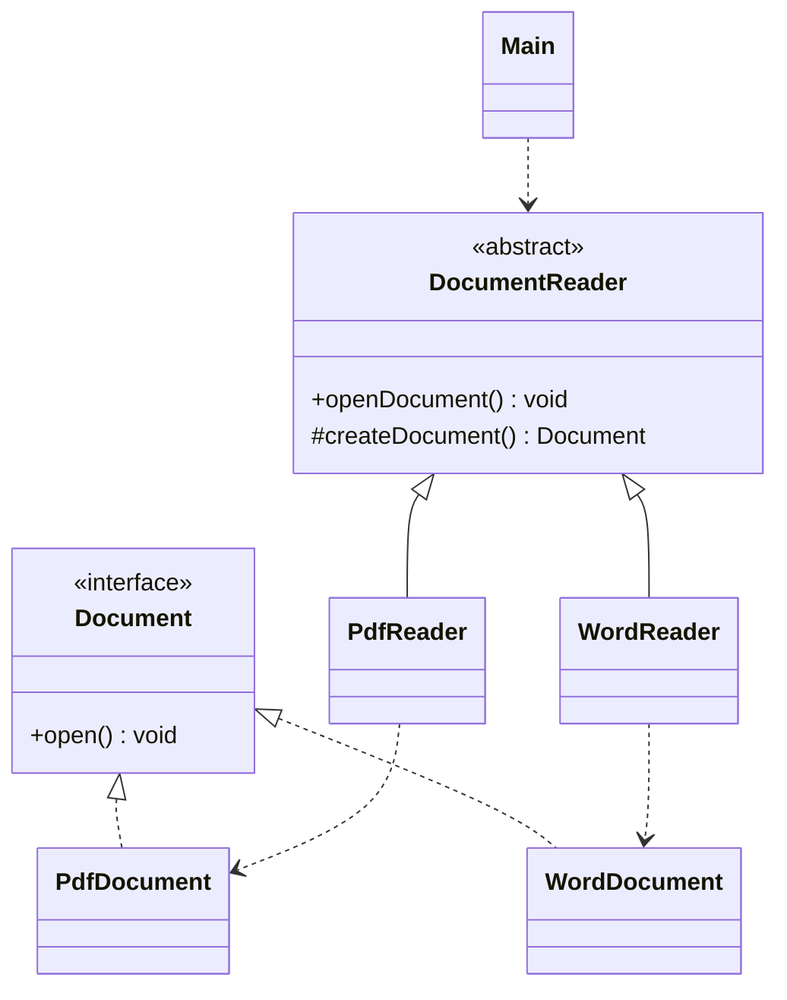
```mermaid
classDiagram
    class Main
    class Document {
        <<interface>>
        +open() void
    }
    class PdfDocument
    class WordDocument
    class DocumentReader {
        <<abstract>>
        +openDocument() void
        #createDocument() Document
    }
    class PdfReader
    class WordReader
    Document <|.. PdfDocument
    Document <|.. WordDocument
    DocumentReader <|-- PdfReader
    DocumentReader <|-- WordReader
    PdfReader ..> PdfDocument
    WordReader ..> WordDocument
    Main ..> DocumentReader
```

```java
interface Document {
    void open();
}

class PdfDocument implements Document {
    public void open() {
        System.out.println("Opening PDF document");
    }
}

class WordDocument implements Document {
    public void open() {
        System.out.println("Opening Word document");
    }
}

abstract class DocumentReader {
    public void openDocument() {
        Document document = createDocument();
        document.open();
    }

    protected abstract Document createDocument();
}

class PdfReader extends DocumentReader {
    protected Document createDocument() {
        return new PdfDocument();
    }
}

class WordReader extends DocumentReader {
    protected Document createDocument() {
        return new WordDocument();
    }
}

public class Main {
    public static void main(String[] args) {
        DocumentReader pdf = new PdfReader();
        DocumentReader word = new WordReader();
        pdf.openDocument();
        word.openDocument();
    }
}
```

---

# Part D — Challenge Mixed Scenarios

These questions are intentionally more ambiguous. In the exam, justify your selected pattern clearly. In some cases, more than one pattern may look possible, but the best answer is the one that directly solves the dominant design problem.

## Question 21 — Notification Channels

A system sends alerts through email, SMS, and push notifications. The alert-sending algorithm is the same from the client’s point of view, but the object created depends on the selected channel. The client should not contain repeated object-creation logic for every alert type.

Required:

- Choose the most suitable design pattern.
- Draw the UML diagram.
- Write the Java implementation.
- Include a `Main` class.

---

## Answer 21 - Notification Channels

**Pattern:** Factory Method

**Justification:** The client should send alerts through a common abstraction while creator classes handle which notification object is created.

```mermaid
classDiagram
    class Main
    class Alert {
        <<interface>>
        +send(String message) void
    }
    class EmailAlert
    class SmsAlert
    class PushAlert
    class AlertSender {
        <<abstract>>
        +sendAlert(String message) void
        #createAlert() Alert
    }
    class EmailAlertSender
    class SmsAlertSender
    class PushAlertSender
    Alert <|.. EmailAlert
    Alert <|.. SmsAlert
    Alert <|.. PushAlert
    AlertSender <|-- EmailAlertSender
    AlertSender <|-- SmsAlertSender
    AlertSender <|-- PushAlertSender
    Main ..> AlertSender
```

```java
interface Alert {
    void send(String message);
}

class EmailAlert implements Alert {
    public void send(String message) {
        System.out.println("Email alert: " + message);
    }
}

class SmsAlert implements Alert {
    public void send(String message) {
        System.out.println("SMS alert: " + message);
    }
}

class PushAlert implements Alert {
    public void send(String message) {
        System.out.println("Push alert: " + message);
    }
}

abstract class AlertSender {
    public void sendAlert(String message) {
        createAlert().send(message);
    }

    protected abstract Alert createAlert();
}

class EmailAlertSender extends AlertSender {
    protected Alert createAlert() {
        return new EmailAlert();
    }
}

class SmsAlertSender extends AlertSender {
    protected Alert createAlert() {
        return new SmsAlert();
    }
}

class PushAlertSender extends AlertSender {
    protected Alert createAlert() {
        return new PushAlert();
    }
}

public class Main {
    public static void main(String[] args) {
        AlertSender sender = new EmailAlertSender();
        sender.sendAlert("Server down");

        sender = new SmsAlertSender();
        sender.sendAlert("Server down");
    }
}
```

---

## Question 22 — Report Viewer

A report viewer displays the same business report in table view, chart view, and summary view. When the report data changes, all currently open views must update automatically. The report model should not know the concrete classes of the views.

Required:

- Choose the most suitable design pattern.
- Draw the UML diagram.
- Write the Java implementation.
- Include a `Main` class.

---

## Answer 22 - Report Viewer

**Pattern:** Observer

**Justification:** Multiple views must update automatically when the report model changes, and the model should not depend on concrete view classes.

```mermaid
classDiagram
    class Main
    class ReportView {
        <<interface>>
        +update(String data) void
    }
    class ReportModel {
        -List views
        -String data
        +attach(ReportView view) void
        +setData(String data) void
    }
    class TableView
    class ChartView
    class SummaryView
    ReportView <|.. TableView
    ReportView <|.. ChartView
    ReportView <|.. SummaryView
    ReportModel --> ReportView
    Main ..> ReportModel
```

```java
import java.util.ArrayList;
import java.util.List;

interface ReportView {
    void update(String data);
}

class ReportModel {
    private final List<ReportView> views = new ArrayList<>();
    private String data;

    public void attach(ReportView view) {
        views.add(view);
    }

    public void setData(String data) {
        this.data = data;
        for (ReportView view : views) {
            view.update(this.data);
        }
    }
}

class TableView implements ReportView {
    public void update(String data) {
        System.out.println("Table view updated: " + data);
    }
}

class ChartView implements ReportView {
    public void update(String data) {
        System.out.println("Chart view updated: " + data);
    }
}

class SummaryView implements ReportView {
    public void update(String data) {
        System.out.println("Summary view updated: " + data);
    }
}

public class Main {
    public static void main(String[] args) {
        ReportModel model = new ReportModel();
        model.attach(new TableView());
        model.attach(new ChartView());
        model.attach(new SummaryView());
        model.setData("Q4 revenue increased");
    }
}
```

---

## Question 23 — Coffee Ordering System

A coffee shop system starts with a basic coffee. Customers can add milk, caramel, cream, chocolate, or extra sugar. The final price and description should change depending on the selected additions. The system should avoid creating a separate subclass for every possible combination.

Required:

- Choose the most suitable design pattern.
- Draw the UML diagram.
- Write the Java implementation.
- Include a `Main` class.

---

## Answer 23 - Coffee Ordering System

**Pattern:** Decorator

**Justification:** Add-ons change description and price dynamically. Decorator avoids creating subclasses for all combinations of milk, caramel, cream, chocolate, and sugar.

```mermaid
classDiagram
    class Main
    class Coffee {
        <<interface>>
        +description() String
        +cost() double
    }
    class BasicCoffee
    class CoffeeAddon {
        <<abstract>>
        #Coffee coffee
    }
    class Milk
    class Caramel
    class Chocolate
    Coffee <|.. BasicCoffee
    Coffee <|.. CoffeeAddon
    CoffeeAddon --> Coffee
    CoffeeAddon <|-- Milk
    CoffeeAddon <|-- Caramel
    CoffeeAddon <|-- Chocolate
    Main ..> Coffee
```

```java
interface Coffee {
    String description();
    double cost();
}

class BasicCoffee implements Coffee {
    public String description() {
        return "Coffee";
    }

    public double cost() {
        return 10;
    }
}

abstract class CoffeeAddon implements Coffee {
    protected final Coffee coffee;

    protected CoffeeAddon(Coffee coffee) {
        this.coffee = coffee;
    }
}

class Milk extends CoffeeAddon {
    public Milk(Coffee coffee) {
        super(coffee);
    }

    public String description() {
        return coffee.description() + ", milk";
    }

    public double cost() {
        return coffee.cost() + 3;
    }
}

class Caramel extends CoffeeAddon {
    public Caramel(Coffee coffee) {
        super(coffee);
    }

    public String description() {
        return coffee.description() + ", caramel";
    }

    public double cost() {
        return coffee.cost() + 5;
    }
}

class Chocolate extends CoffeeAddon {
    public Chocolate(Coffee coffee) {
        super(coffee);
    }

    public String description() {
        return coffee.description() + ", chocolate";
    }

    public double cost() {
        return coffee.cost() + 6;
    }
}

public class Main {
    public static void main(String[] args) {
        Coffee coffee = new Chocolate(new Caramel(new Milk(new BasicCoffee())));
        System.out.println(coffee.description());
        System.out.println(coffee.cost());
    }
}
```

---

## Question 24 — Music Playlist

A music application stores songs in a playlist. Client code should move through songs one at a time using `hasNext()` and `next()`. The playlist’s internal data structure should not be exposed to the client.

Required:

- Choose the most suitable design pattern.
- Draw the UML diagram.
- Write the Java implementation.
- Include a `Main` class.

---

## Answer 24 - Music Playlist

**Pattern:** Iterator

**Justification:** The playlist exposes `hasNext()` and `next()` traversal while hiding its internal storage.

```mermaid
classDiagram
    class Main
    class SongIterator {
        +hasNext() boolean
        +next() Song
    }
    class Playlist {
        -List songs
        +add(Song song) void
        +iterator() SongIterator
    }
    class Song
    Playlist --> Song
    Playlist ..> SongIterator
    SongIterator --> Playlist
    Main ..> SongIterator
```

```java
import java.util.ArrayList;
import java.util.List;

class Song {
    private final String title;

    public Song(String title) {
        this.title = title;
    }

    public String getTitle() {
        return title;
    }
}

class Playlist {
    private final List<Song> songs = new ArrayList<>();

    public void add(Song song) {
        songs.add(song);
    }

    public Song get(int index) {
        return songs.get(index);
    }

    public int size() {
        return songs.size();
    }

    public SongIterator iterator() {
        return new SongIterator(this);
    }
}

class SongIterator {
    private final Playlist playlist;
    private int index;

    public SongIterator(Playlist playlist) {
        this.playlist = playlist;
    }

    public boolean hasNext() {
        return index < playlist.size();
    }

    public Song next() {
        return playlist.get(index++);
    }
}

public class Main {
    public static void main(String[] args) {
        Playlist playlist = new Playlist();
        playlist.add(new Song("Intro"));
        playlist.add(new Song("Finale"));

        SongIterator iterator = playlist.iterator();
        while (iterator.hasNext()) {
            System.out.println(iterator.next().getTitle());
        }
    }
}
```

---

## Question 25 — Database Connection Manager

A server application needs one shared object responsible for managing database connection settings and providing access to the active connection pool. Creating several managers could cause duplicate pools and inconsistent configuration. The object must be globally accessible in a controlled way.

Required:

- Choose the most suitable design pattern.
- Draw the UML diagram.
- Write the Java implementation.
- Include a `Main` class.

---

## Answer 25 - Database Connection Manager

**Pattern:** Singleton

**Justification:** The application needs one controlled shared manager for database connection settings and the active connection pool.

```mermaid
classDiagram
    class Main
    class DatabaseConnectionManager {
        -static DatabaseConnectionManager instance
        -String url
        -DatabaseConnectionManager()
        +static getInstance() DatabaseConnectionManager
        +connect() void
    }
    Main ..> DatabaseConnectionManager
```

```java
class DatabaseConnectionManager {
    private static DatabaseConnectionManager instance;
    private final String url = "jdbc:mysql://localhost/app";

    private DatabaseConnectionManager() {}

    public static DatabaseConnectionManager getInstance() {
        if (instance == null) {
            instance = new DatabaseConnectionManager();
        }
        return instance;
    }

    public void connect() {
        System.out.println("Using connection pool for " + url);
    }
}

public class Main {
    public static void main(String[] args) {
        DatabaseConnectionManager one = DatabaseConnectionManager.getInstance();
        DatabaseConnectionManager two = DatabaseConnectionManager.getInstance();

        one.connect();
        System.out.println(one == two);
    }
}
```

---

## Question 26 — Remote Control Devices

A remote-control application supports TVs and radios. It also supports basic remotes and advanced remotes. The system should allow new devices and new remote types to be added independently, without creating subclasses for every combination such as `BasicTVRemote`, `AdvancedTVRemote`, `BasicRadioRemote`, and `AdvancedRadioRemote`.

Required:

- Choose the most suitable design pattern.
- Draw the UML diagram.
- Write the Java implementation.
- Include a `Main` class.

---

## Answer 26 - Remote Control Devices

**Pattern:** Bridge

**Justification:** Remote types and device types vary independently. Bridge avoids subclasses for every remote-device combination.

```mermaid
classDiagram
    class Main
    class Device {
        <<interface>>
        +turnOn() void
        +turnOff() void
    }
    class TV
    class Radio
    class Remote {
        #Device device
        +powerOn() void
        +powerOff() void
    }
    class AdvancedRemote
    Device <|.. TV
    Device <|.. Radio
    Remote --> Device
    Remote <|-- AdvancedRemote
    Main ..> Remote
```

```java
interface Device {
    void turnOn();
    void turnOff();
}

class TV implements Device {
    public void turnOn() {
        System.out.println("TV on");
    }

    public void turnOff() {
        System.out.println("TV off");
    }
}

class Radio implements Device {
    public void turnOn() {
        System.out.println("Radio on");
    }

    public void turnOff() {
        System.out.println("Radio off");
    }
}

class Remote {
    protected final Device device;

    public Remote(Device device) {
        this.device = device;
    }

    public void powerOn() {
        device.turnOn();
    }

    public void powerOff() {
        device.turnOff();
    }
}

class AdvancedRemote extends Remote {
    public AdvancedRemote(Device device) {
        super(device);
    }

    public void mute() {
        System.out.println("Device muted");
    }
}

public class Main {
    public static void main(String[] args) {
        Remote tvRemote = new Remote(new TV());
        AdvancedRemote radioRemote = new AdvancedRemote(new Radio());
        tvRemote.powerOn();
        radioRemote.powerOn();
        radioRemote.mute();
    }
}
```

---

## Question 27 — Document Conversion Pipeline

A document converter follows several stages: read input, parse content, convert format, and save output. Each specific converter may customize parsing and conversion, but the overall sequence must not change.

Required:

- Choose the most suitable design pattern.
- Draw the UML diagram.
- Write the Java implementation.
- Include a `Main` class.

---

## Answer 27 - Document Conversion Pipeline

**Pattern:** Template Method

**Justification:** The conversion pipeline has a fixed sequence, but specific converters customize parsing and conversion.

```mermaid
classDiagram
    class Main
    class DocumentConverter {
        <<abstract>>
        +convert() void
        #readInput() void
        #parseContent() void
        #convertFormat() void
        #saveOutput() void
    }
    class PdfToHtmlConverter
    class WordToPdfConverter
    DocumentConverter <|-- PdfToHtmlConverter
    DocumentConverter <|-- WordToPdfConverter
    Main ..> DocumentConverter
```

```java
abstract class DocumentConverter {
    public final void convert() {
        readInput();
        parseContent();
        convertFormat();
        saveOutput();
    }

    protected void readInput() {
        System.out.println("Reading input");
    }

    protected abstract void parseContent();
    protected abstract void convertFormat();

    protected void saveOutput() {
        System.out.println("Saving output");
    }
}

class PdfToHtmlConverter extends DocumentConverter {
    protected void parseContent() {
        System.out.println("Parsing PDF");
    }

    protected void convertFormat() {
        System.out.println("Converting PDF to HTML");
    }
}

class WordToPdfConverter extends DocumentConverter {
    protected void parseContent() {
        System.out.println("Parsing Word");
    }

    protected void convertFormat() {
        System.out.println("Converting Word to PDF");
    }
}

public class Main {
    public static void main(String[] args) {
        new PdfToHtmlConverter().convert();
        new WordToPdfConverter().convert();
    }
}
```

---

## Question 28 — Character Rendering in a Text Editor

A text editor displays millions of characters. Many characters share the same font family, font size, and style. The unique part is the character’s position and actual symbol. The editor should avoid storing duplicated formatting information in every character object.

Required:

- Choose the most suitable design pattern.
- Draw the UML diagram.
- Write the Java implementation.
- Include a `Main` class.

---

## Answer 28 - Character Rendering in a Text Editor

**Pattern:** Flyweight

**Justification:** Font family, font size, and style are shared intrinsic state. Symbol and position are unique extrinsic state.

```mermaid
classDiagram
    class Main
    class CharacterStyle {
        -String fontFamily
        -int fontSize
        -String style
        +draw(char symbol, int x, int y) void
    }
    class CharacterStyleFactory {
        -Map styles
        +getStyle(String family, int size, String style) CharacterStyle
    }
    class TextCharacter {
        -char symbol
        -int x
        -int y
        -CharacterStyle style
        +draw() void
    }
    CharacterStyleFactory --> CharacterStyle
    TextCharacter --> CharacterStyle
    Main ..> CharacterStyleFactory
```

```java
import java.util.HashMap;
import java.util.Map;

class CharacterStyle {
    private final String fontFamily;
    private final int fontSize;
    private final String style;

    public CharacterStyle(String fontFamily, int fontSize, String style) {
        this.fontFamily = fontFamily;
        this.fontSize = fontSize;
        this.style = style;
    }

    public void draw(char symbol, int x, int y) {
        System.out.println(symbol + " at " + x + "," + y +
            " using " + fontFamily + " " + fontSize + " " + style);
    }
}

class CharacterStyleFactory {
    private static final Map<String, CharacterStyle> styles = new HashMap<>();

    public static CharacterStyle getStyle(String family, int size, String style) {
        String key = family + "-" + size + "-" + style;
        styles.putIfAbsent(key, new CharacterStyle(family, size, style));
        return styles.get(key);
    }
}

class TextCharacter {
    private final char symbol;
    private final int x;
    private final int y;
    private final CharacterStyle style;

    public TextCharacter(char symbol, int x, int y, CharacterStyle style) {
        this.symbol = symbol;
        this.x = x;
        this.y = y;
        this.style = style;
    }

    public void draw() {
        style.draw(symbol, x, y);
    }
}

public class Main {
    public static void main(String[] args) {
        CharacterStyle arial = CharacterStyleFactory.getStyle("Arial", 12, "bold");
        new TextCharacter('A', 0, 0, arial).draw();
        new TextCharacter('B', 10, 0, arial).draw();
    }
}
```

---

## Question 29 — Air Traffic Control

Several airplanes need to coordinate landing and takeoff. Direct communication between all airplanes would be complex and unsafe. Instead, one control tower receives requests and coordinates communication between airplanes.

Required:

- Choose the most suitable design pattern.
- Draw the UML diagram.
- Write the Java implementation.
- Include a `Main` class.

---

## Answer 29 - Air Traffic Control

**Pattern:** Mediator

**Justification:** A control tower coordinates airplane communication and decisions, avoiding unsafe many-to-many direct communication.

```mermaid
classDiagram
    class Main
    class AirTrafficControl {
        <<interface>>
        +requestLanding(Airplane plane) void
        +register(Airplane plane) void
    }
    class ControlTower
    class Airplane {
        -String id
        -AirTrafficControl tower
        +requestLanding() void
        +receive(String message) void
    }
    AirTrafficControl <|.. ControlTower
    Airplane --> AirTrafficControl
    ControlTower --> Airplane
    Main ..> AirTrafficControl
```

```java
import java.util.ArrayList;
import java.util.List;

interface AirTrafficControl {
    void register(Airplane plane);
    void requestLanding(Airplane plane);
}

class ControlTower implements AirTrafficControl {
    private final List<Airplane> planes = new ArrayList<>();

    public void register(Airplane plane) {
        planes.add(plane);
    }

    public void requestLanding(Airplane plane) {
        plane.receive("Landing approved");
        for (Airplane other : planes) {
            if (other != plane) {
                other.receive("Hold position");
            }
        }
    }
}

class Airplane {
    private final String id;
    private final AirTrafficControl tower;

    public Airplane(String id, AirTrafficControl tower) {
        this.id = id;
        this.tower = tower;
    }

    public void requestLanding() {
        tower.requestLanding(this);
    }

    public void receive(String message) {
        System.out.println(id + ": " + message);
    }
}

public class Main {
    public static void main(String[] args) {
        AirTrafficControl tower = new ControlTower();
        Airplane a1 = new Airplane("A1", tower);
        Airplane a2 = new Airplane("A2", tower);
        tower.register(a1);
        tower.register(a2);
        a1.requestLanding();
    }
}
```

---

## Question 30 — Third-Party Payment Gateway

An e-commerce system expects payment classes to implement:

```java
void pay(double amount);
```

A third-party payment provider offers this method instead:

```java
void makePayment(String currency, double value);
```

The third-party class cannot be edited. The e-commerce system should use it without changing its own payment interface.

Required:

- Choose the most suitable design pattern.
- Draw the UML diagram.
- Write the Java implementation.
- Include a `Main` class.

---

# Answer Key — Pattern Only

Use this section only after attempting the questions.

| Question | Expected Pattern |
|---:|---|
| 1 | Singleton |
| 2 | Strategy |
| 3 | Decorator |
| 4 | Template Method |
| 5 | Adapter |
| 6 | Abstract Factory |
| 7 | Observer |
| 8 | Bridge |
| 9 | Mediator |
| 10 | Factory Method |
| 11 | Iterator |
| 12 | Decorator |
| 13 | Flyweight |
| 14 | Abstract Factory |
| 15 | Strategy |
| 16 | Template Method |
| 17 | Mediator |
| 18 | Adapter |
| 19 | Observer |
| 20 | Factory Method |
| 21 | Factory Method |
| 22 | Observer |
| 23 | Decorator |
| 24 | Iterator |
| 25 | Singleton |
| 26 | Bridge |
| 27 | Template Method |
| 28 | Flyweight |
| 29 | Mediator |
| 30 | Adapter |

---

# Notes for Self-Checking

A strong exam answer should not only name the pattern. It should show why the selected pattern solves the dominant design issue.

- Singleton: one controlled shared instance.
- Factory Method: object creation deferred to creator/subclass or factory logic while client depends on abstraction.
- Abstract Factory: creation of related families of objects.
- Adapter: incompatible interface must be made usable through expected interface.
- Bridge: independent variation along two dimensions.
- Decorator: optional behavior added dynamically without subclass explosion.
- Flyweight: many similar objects share intrinsic state to reduce memory usage.
- Template Method: fixed algorithm skeleton with customizable steps.
- Strategy: interchangeable algorithm or behavior selected at runtime.
- Iterator: sequential traversal without exposing internal representation.
- Mediator: central coordinator reduces many-to-many object communication.
- Observer: dependents are notified automatically when subject state changes.

---

## Answer 30 - Third-Party Payment Gateway

**Pattern:** Adapter

**Justification:** The third-party gateway cannot be changed, so an adapter translates the expected `pay(double amount)` call into `makePayment(String currency, double value)`.

```mermaid
classDiagram
    class Main
    class Payment {
        <<interface>>
        +pay(double amount) void
    }
    class ThirdPartyGateway {
        +makePayment(String currency, double value) void
    }
    class ThirdPartyPaymentAdapter {
        -ThirdPartyGateway gateway
        -String currency
        +pay(double amount) void
    }
    Payment <|.. ThirdPartyPaymentAdapter
    ThirdPartyPaymentAdapter --> ThirdPartyGateway
    Main ..> Payment
```

```java
interface Payment {
    void pay(double amount);
}

class ThirdPartyGateway {
    public void makePayment(String currency, double value) {
        System.out.println("Paid " + value + " " + currency);
    }
}

class ThirdPartyPaymentAdapter implements Payment {
    private final ThirdPartyGateway gateway;
    private final String currency;

    public ThirdPartyPaymentAdapter(ThirdPartyGateway gateway, String currency) {
        this.gateway = gateway;
        this.currency = currency;
    }

    public void pay(double amount) {
        gateway.makePayment(currency, amount);
    }
}

public class Main {
    public static void main(String[] args) {
        Payment payment = new ThirdPartyPaymentAdapter(new ThirdPartyGateway(), "USD");
        payment.pay(250);
    }
}
```
