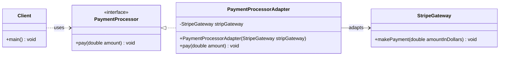
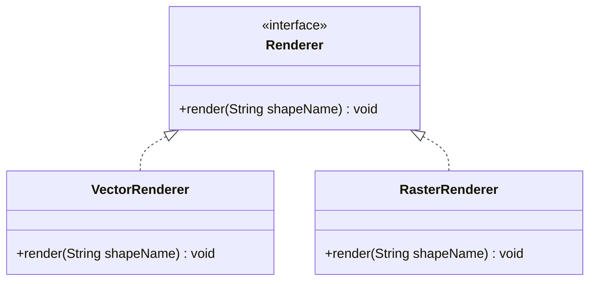
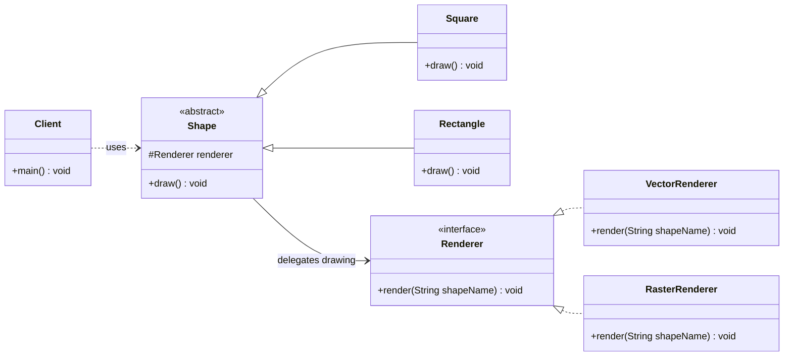
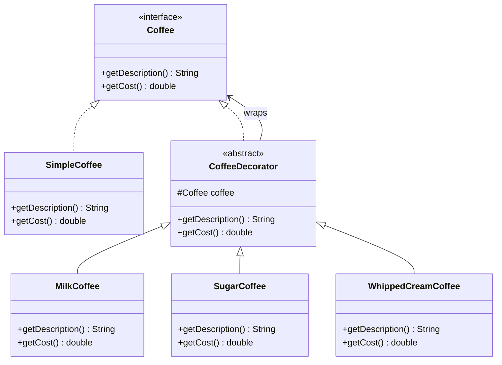
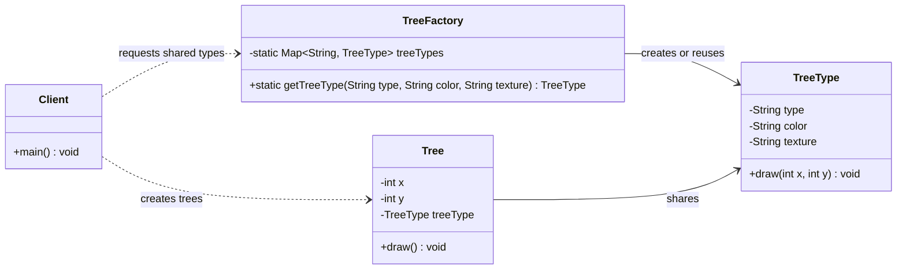

# Structural Design Patterns Guide

This file documents the structural design patterns implemented in [`structural_design_patterns/Main.java`](structural_design_patterns/Main.java).

Structural patterns deals with how inheritance and composition
can be used to provide extra functionality.

Structural design patterns explain how to assemble objects and
classes into larger structures, while keeping these structures
flexible and efficient and easy to maintain.

By using structural patterns, you can better manage complex
class hierarchies, reuse existing code, and create scalable
architectures.

Structural Patterns in addition target flexible object composition
at runtime which is impossible with static class composition

There are four structural patterns implemented in this project:

1. Adapter makes an incompatible class work with an expected interface.
2. Bridge separates an abstraction from the implementation it uses.
3. Decorator adds extra behavior to an object without changing its original class.
4. Flyweight shares repeated object data to reduce memory usage.

| Pattern | Implemented example | Main purpose | Main SOLID focus |
|---|---|---|---|
| Adapter | `PaymentProcessorAdapter` | Make `StripeGateway` work with `PaymentProcessor` | DIP and OCP |
| Bridge | `Shape` with `Renderer` | Separate shapes from rendering engines | OCP and DIP |
| Decorator | `CoffeeDecorator` | Add coffee extras dynamically | OCP and SRP |
| Flyweight | `TreeFactory` and `TreeType` | Share repeated tree type data | SRP and memory efficiency |

> Note: Design patterns do not map perfectly to one SOLID principle. The table shows the principle each pattern supports most clearly in this code.

---

## 1. Adapter Design Pattern

### Where it appears

The Adapter pattern is implemented using:

1. `PaymentProcessor`
2. `StripeGateway`
3. `PaymentProcessorAdapter`

The application expects payment services to follow the `PaymentProcessor` interface:

```java
interface PaymentProcessor {
    void pay(double amount);
}
```

The third-party `StripeGateway` class has a different method name:

```java
class StripeGateway {
    public void makePayment(double amountInDollars) {
        System.out.println("Paid $" + amountInDollars + " using Stripe");
    }
}
```

The adapter makes `StripeGateway` compatible with `PaymentProcessor`:

```java
class PaymentProcessorAdapter implements PaymentProcessor {
    private final StripeGateway stripGateway;

    public PaymentProcessorAdapter(StripeGateway stripGateway) {
        this.stripGateway = stripGateway;
    }

    @Override
    public void pay(double amount) {
        stripGateway.makePayment(amount);
    }
}
```

### When it is used

Use Adapter when an existing class provides useful functionality, but its interface does not match what the application expects.

Common examples:

1. Integrating a third-party payment gateway.
2. Connecting a legacy API to a modern interface.
3. Making an external library fit an existing application contract.
4. Wrapping different vendor services behind one common interface.

In this project, the application expects a `PaymentProcessor`, but `StripeGateway` does not implement that interface. `PaymentProcessorAdapter` solves this by translating `pay()` into `makePayment()`.

### Main SOLID principle focus

Adapter mainly supports the **Dependency Inversion Principle (DIP)**.

The client code depends on the `PaymentProcessor` abstraction instead of depending directly on the concrete `StripeGateway` class.

It also supports the **Open/Closed Principle (OCP)** because new third-party payment services can be integrated by adding new adapter classes without changing the client code.

### UML diagram



---

## 2. Bridge Design Pattern

### Where it appears

The Bridge pattern is implemented using:

1. `Renderer`
2. `VectorRenderer`
3. `RasterRenderer`
4. `Shape`
5. `Square`
6. `Rectangle`

The implementation side is represented by the `Renderer` interface:

```java
interface Renderer {
    void render(String shapeName);
}
```

Concrete renderers provide different drawing implementations:

```java
class VectorRenderer implements Renderer {
    @Override
    public void render(String shapeName) {
        System.out.println("drawing " + shapeName + " using vector renderer");
    }
}
```

The abstraction side is represented by `Shape`:

```java
abstract class Shape {
    protected Renderer renderer;

    protected Shape(Renderer renderer) {
        this.renderer = renderer;
    }

    public abstract void draw();
}
```

Concrete shapes use the renderer abstraction:

```java
class Square extends Shape {
    public Square(Renderer renderer) {
        super(renderer);
    }

    @Override
    public void draw() {
        renderer.render("square");
    }
}
```

### When it is used

Use Bridge when an abstraction and its implementation should vary independently.

Common examples:

1. Shapes drawn by different rendering engines.
2. Remote controls working with different devices.
3. UI components rendered by different platforms.
4. Reports exported using different output engines.

In this project, `Shape` and `Renderer` can evolve independently. A new shape can be added without changing the renderer classes, and a new renderer can be added without changing the shape classes.

### Main SOLID principle focus

Bridge mainly supports the **Open/Closed Principle (OCP)**.

The system is open for extension because new shapes and new renderers can be added independently.

It also supports the **Dependency Inversion Principle (DIP)** because `Shape` depends on the `Renderer` abstraction rather than concrete classes such as `VectorRenderer` or `RasterRenderer`.

### UML diagram

#### Renderer hierarchy



#### Shape hierarchy and bridge relationship



---

## 3. Decorator Design Pattern

### Where it appears

The Decorator pattern is implemented using:

1. `Coffee`
2. `SimpleCoffee`
3. `CoffeeDecorator`
4. `MilkCoffee`
5. `SugarCoffee`
6. `WhippedCreamCoffee`

The common component interface defines the operations:

```java
interface Coffee {
    String getDescription();
    double getCost();
}
```

The base object is `SimpleCoffee`:

```java
class SimpleCoffee implements Coffee {
    @Override
    public String getDescription() {
        return "Coffee was added";
    }

    @Override
    public double getCost() {
        return 10.0;
    }
}
```

The abstract decorator stores another `Coffee` object and delegates to it:

```java
abstract class CoffeeDecorator implements Coffee {
    protected final Coffee coffee;

    protected CoffeeDecorator(Coffee coffee) {
        this.coffee = coffee;
    }

    @Override
    public String getDescription() {
        return coffee.getDescription();
    }

    @Override
    public double getCost() {
        return coffee.getCost();
    }
}
```

Concrete decorators add their own behavior:

```java
class MilkCoffee extends CoffeeDecorator {
    public MilkCoffee(Coffee coffee) {
        super(coffee);
    }

    @Override
    public String getDescription() {
        return super.getDescription() + "Milk was added.";
    }

    @Override
    public double getCost() {
        return super.getCost() + 5.0;
    }
}
```

### When it is used

Use Decorator when an object needs optional behavior or features, and subclassing would create too many combinations.

Common examples:

1. Coffee extras such as milk, sugar, and whipped cream.
2. Adding compression or encryption to file streams.
3. Adding logging or caching around services.
4. Adding visual borders or scrolling to UI components.

In this project, a `SimpleCoffee` can be wrapped with `WhippedCreamCoffee`, `SugarCoffee`, and `MilkCoffee`. Each wrapper adds to the description and cost.

### Main SOLID principle focus

Decorator mainly supports the **Open/Closed Principle (OCP)**.

New coffee extras can be added as new decorators without changing `SimpleCoffee` or the existing decorators.

It also supports the **Single Responsibility Principle (SRP)** because each decorator has one focused responsibility, such as adding milk or adding sugar.

### UML diagram



---

## 4. Flyweight Design Pattern

### Where it appears

The Flyweight pattern is implemented using:

1. `TreeType`
2. `TreeFactory`
3. `Tree`

The shared flyweight object stores intrinsic data:

```java
class TreeType {
    private final String type;
    private final String color;
    private final String texture;

    public TreeType(String type, String color, String texture) {
        this.type = type;
        this.color = color;
        this.texture = texture;
    }

    public void draw(int x, int y) {
        System.out.println("Drawing tree of type " + type +
        " using " + color + " color " + "with texture " + texture +
        " at x_axis equals " + x + " and y_axis equals " + y + ".");
    }
}
```

The factory reuses existing `TreeType` objects:

```java
class TreeFactory {
    private static final Map<String, TreeType> treeTypes = new HashMap<>();

    public static TreeType getTreeType(String type, String color, String texture) {
        String key = type + "-" + color + "-" + texture;
        if (!treeTypes.containsKey(key)) {
            treeTypes.put(key, new TreeType(type, color, texture));
        }
        return treeTypes.get(key);
    }
}
```

Each `Tree` stores only its extrinsic data and references the shared tree type:

```java
class Tree {
    private final int x;
    private final int y;
    private final TreeType treeType;

    public Tree(int x, int y, TreeType treeType) {
        this.x = x;
        this.y = y;
        this.treeType = treeType;
    }

    public void draw() {
        treeType.draw(x, y);
    }
}
```

### When it is used

Use Flyweight when many objects share repeated data and storing that data separately in every object would waste memory.

Common examples:

1. Forest simulation trees.
2. Text editor characters that share font data.
3. Game particles with shared textures.
4. Map markers with shared icons.

In this project, many `Tree` objects may share the same `TreeType`. The tree position is stored in each `Tree`, while repeated data such as type, color, and texture is stored once in `TreeType`.

### Main SOLID principle focus

Flyweight mainly supports the **Single Responsibility Principle (SRP)**.

`TreeType` is responsible for shared tree data, while `Tree` is responsible for unique position data.

The pattern also improves memory efficiency because repeated intrinsic data is stored once and reused through `TreeFactory`.

### UML diagram



---

## Quick Comparison

| Pattern | Problem it solves | What the client avoids |
|---|---|---|
| Adapter | An existing class has an incompatible interface | Changing third-party or legacy code |
| Bridge | Abstraction and implementation vary independently | Creating many combined subclasses |
| Decorator | Optional behavior must be added dynamically | Building many subclasses for every feature combination |
| Flyweight | Many objects repeat the same internal data | Storing duplicate data in every object |

## Summary

The implemented structural patterns organize relationships between classes and objects:

1. `PaymentProcessorAdapter` adapts `StripeGateway` to the expected payment interface.
2. `Shape` and `Renderer` use Bridge to vary shapes and renderers independently.
3. `CoffeeDecorator` adds optional coffee extras without modifying the base coffee class.
4. `TreeFactory` and `TreeType` use Flyweight to share repeated tree data across many tree objects.
